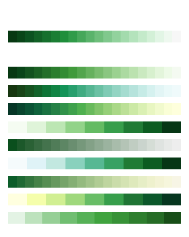
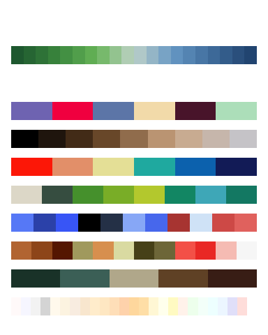
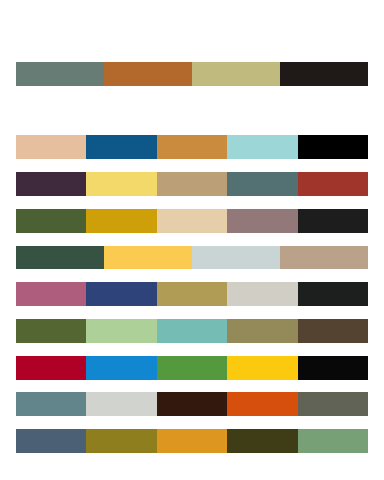

## Run down of the code used for the talk

Packages needed

``` r
library(tidyverse)
library(paletteer)
library(farver)
library(colorspace)
library(colorscience)
library(recipes)
library(pdist)
```

We source in 3 files. First file compiles the initial dataset with
colors as a list-column. Second file includes the hand-engineered
feature functions. Last file is a custom plotting function taken from
<https://github.com/EmilHvitfeldt/r-color-palettes>.

``` r
source("R/data_list.R")
source("R/feature_functions.R")
source("R/list_plotter.R")
```

Looking at the initial data

``` r
head(data_list)
```

    ##         package   palette       type length group
    ## 1 gameofthrones baratheon sequential     20     c
    ## 2 gameofthrones   greyjoy sequential     20     c
    ## 3 gameofthrones  jon_snow sequential     20     c
    ## 4 gameofthrones lannister sequential     20     c
    ## 5 gameofthrones   martell sequential     20     c
    ## 6 gameofthrones     stark sequential     20     c
    ##                                                                                                                                                                                                                       colors
    ## 1 #02060BFF, #211D0CFF, #41340DFF, #604B0EFF, #806210FF, #997511FF, #A07B12FF, #A78113FF, #AD8715FF, #B48D16FF, #BD9414FF, #C99D0FFF, #D5A60AFF, #E1AE06FF, #EDB701FF, #F2C427FF, #F5D35BFF, #F8E190FF, #FBEFC4FF, #FEFEF9FF
    ## 2 #000000FF, #0B0908FF, #171311FF, #221D19FF, #2E2622FF, #3A302BFF, #463B34FF, #52463DFF, #5F5147FF, #6B5C50FF, #7F6C55FF, #998157FF, #B49759FF, #CEAC5BFF, #E9C15DFF, #EFC458FF, #EEC150FF, #EDBE48FF, #ECBB40FF, #ECB939FF
    ## 3 #132525FF, #122727FF, #122A2AFF, #112D2DFF, #112F2FFF, #163535FF, #2B4343FF, #3F5051FF, #545E5FFF, #696C6DFF, #777B7CFF, #7E8B8CFF, #859C9CFF, #8CADACFF, #93BDBCFF, #86BFBEFF, #72BBBAFF, #5EB7B6FF, #4AB3B2FF, #36AFAEFF
    ## 4 #5C0000FF, #650000FF, #6E0000FF, #780000FF, #810000FF, #8C0000FF, #980000FF, #A50000FF, #B20000FF, #BE0000FF, #CA0D00FF, #D62700FF, #E14200FF, #EC5C00FF, #F87700FF, #FB8400FF, #FC8D00FF, #FD9500FF, #FE9E00FF, #FFA700FF
    ## 5 #F1B043FF, #F3AA39FF, #F6A430FF, #F99E27FF, #FC991DFF, #FE9315FF, #FA8C10FF, #F7840CFF, #F47D07FF, #F07602FF, #EE6E00FF, #EE6500FF, #ED5B00FF, #ED5200FF, #ED4900FF, #E33B00FF, #D72C00FF, #CA1D00FF, #BE0E00FF, #B20000FF
    ## 6 #17181DFF, #191A1FFF, #1C1D22FF, #1F2025FF, #222227FF, #26262BFF, #2B2B30FF, #2F3035FF, #34363BFF, #393B40FF, #3E4046FF, #44464DFF, #4A4C54FF, #4F515BFF, #555762FF, #60626DFF, #6D6E7AFF, #7A7A87FF, #878694FF, #9593A2FF

Here we combine `mutate` with some *purrr* magic to apply the feature
functions to the data.

``` r
data_num <- data_list %>%
  mutate(# contains all a certain color
         contains_yellow = map_dbl(colors, ~ color_contains(.x, "yellow", "hsv")),
         contains_orange = map_dbl(colors, ~ color_contains(.x, "orange", "hsv")),
         contains_red = map_dbl(colors, ~ color_contains(.x, "red", "hsv")),
         contains_purple = map_dbl(colors, ~ color_contains(.x, "purple", "hsv")),
         contains_blue = map_dbl(colors, ~ color_contains(.x, "blue", "hsv")),
         contains_green = map_dbl(colors, ~ color_contains(.x, "green", "hsv")),
         contains_brown = map_dbl(colors, ~ color_contains(.x, "brown", "hsv")),
         contains_white = map_dbl(colors, ~ color_contains(.x, "white", "hsv")),
         contains_black = map_dbl(colors, ~ color_contains(.x, "black", "hsv")),
         # All a certain color
         all_contains_yellow = map_dbl(colors, ~ color_all_contains(.x, "yellow", "hsv")),
         all_contains_orange = map_dbl(colors, ~ color_all_contains(.x, "orange", "hsv")),
         all_contains_red = map_dbl(colors, ~ color_all_contains(.x, "red", "hsv")),
         all_contains_purple = map_dbl(colors, ~ color_all_contains(.x, "purple", "hsv")),
         all_contains_blue = map_dbl(colors, ~ color_all_contains(.x, "blue", "hsv")),
         all_contains_green = map_dbl(colors, ~ color_all_contains(.x, "green", "hsv")),
         all_contains_brown = map_dbl(colors, ~ color_all_contains(.x, "brown", "hsv")),
         all_contains_white = map_dbl(colors, ~ color_all_contains(.x, "white", "hsv")),
         all_contains_black = map_dbl(colors, ~ color_all_contains(.x, "black", "hsv")),
         # Is it linear in a perceptually uniform space
         linear = map_dbl(colors, ~ linear(.x, "hunterlab")),
         linear_deutan = map_dbl(colors, ~ linear(deutan(.x), "hunterlab")),
         linear_protan = map_dbl(colors, ~ linear(protan(.x), "hunterlab")),
         linear_tritan = map_dbl(colors, ~ linear(tritan(.x), "hunterlab")),
         # Twice linear
         twice_linear = map_dbl(colors, ~ linear_split(.x, "hunterlab")),
         twice_linear_deutan = map_dbl(colors, ~ linear_split(deutan(.x), "hunterlab")),
         twice_linear_protan = map_dbl(colors, ~ linear_split(protan(.x), "hunterlab")),
         twice_linear_tritan = map_dbl(colors, ~ linear_split(tritan(.x), "hunterlab")),
         # Min distance between points
         min_distance = map_dbl(colors, ~ min_distance(.x, "hunterlab")),
         min_distance_deutan = map_dbl(colors, ~ min_distance(deutan(.x), "hunterlab")),
         min_distance_protan = map_dbl(colors, ~ min_distance(protan(.x), "hunterlab")),
         min_distance_tritan = map_dbl(colors, ~ min_distance(tritan(.x), "hunterlab")),
         # Max distance between points
         max_distance = map_dbl(colors, ~ max_distance(.x, "hunterlab")),
         max_distance_deutan = map_dbl(colors, ~ max_distance(deutan(.x), "hunterlab")),
         max_distance_protan = map_dbl(colors, ~ max_distance(protan(.x), "hunterlab")),
         max_distance_tritan = map_dbl(colors, ~ max_distance(tritan(.x), "hunterlab")),
         # IQR distance between points
         iqr_distance = map_dbl(colors, ~ iqr_distance(.x, "hunterlab")),
         iqr_distance_deutan = map_dbl(colors, ~ iqr_distance(deutan(.x), "hunterlab")),
         iqr_distance_protan = map_dbl(colors, ~ iqr_distance(protan(.x), "hunterlab")),
         iqr_distance_tritan = map_dbl(colors, ~ iqr_distance(tritan(.x), "hunterlab"))
         )
```

Creating dummy variables and scaling.

``` r
data_meta <- data_num %>%
  mutate(id = as.character(str_glue("{package}-{palette}-{group}")))

data_prescaled <- data_meta %>%
  select(-package, -palette, -colors) %>%
  mutate_at(vars(type, group), as.factor)

re <- recipe(id ~ ., data = data_prescaled) %>%
  step_dummy(type, group) %>%
  step_center(all_predictors()) %>%
  step_scale(all_predictors()) %>%
  prep()

data_scaled <- bake(re, new_data = data_prescaled)
```

saving data.

``` r
fs::dir_create("data")
write_csv(data_scaled, "data/data_scaled.csv")
write_rds(data_meta, "data/data_meta.rds")
```

Reading data.

``` r
data_scaled <- read_csv("data/data_scaled.csv")
data_meta <- read_rds("data/data_meta.rds")
```

Plotting function, takes the arguement pick and n. Pick must be “guess”,
“random” or “user”. See examples below for use.

``` r
example <- function(pick = "guess", n = 9, pal) {
  
  sample <- data_scaled %>% 
    sample_n(1) %>%
    mutate(id = as.character(id))
  
  if (pick == "user") {
    sample <- tibble(id = paste(pal$package, 
                                pal$palette, 
                                pal$group, 
                                sep = "-", collapse = "")) %>%
      left_join(data_scaled, by = "id")
  }
  
  if (pick %in% c("guess", "user")) {
    guesses <- pdist(X = select(data_scaled, -id), Y = select(sample, -id))@dist %>%
      tibble(sum = .,
             id = data_meta$id) %>% 
      arrange(sum) %>% 
      slice(seq_len(n + 1))
  }
  if (pick == "random") {
    guesses <- tibble(id = sample(data_meta$id, n))
  }
  
  main <- left_join(sample, data_meta, by = "id") %>%
    select(colors, package, palette, group)
  
  full_guesses <- left_join(guesses, data_meta, by = "id") %>% slice(-1)
  
  print(main %>%
    mutate(out = str_glue("paletteer_{group}(\"{package}::{palette}\")")) %>%
    pull(out))
  print("------------")
  print(full_guesses %>%
    mutate(out = str_glue("paletteer_{group}(\"{package}::{palette}\")")) %>%
    pull(out))
  
  plot_colors <- c(main %>% pull(colors), 
                   c("#FFFFFF"), 
                   left_join(guesses, data_meta, by = "id") %>% 
                     slice(-1) %>% 
                     pull(colors))
  
  list_plotter(plot_colors, names = "", package_name = "")
}
```

``` r
example()
```

    ## paletteer_c("grDevices::Greens 3")
    ## [1] "------------"
    ## paletteer_c("grDevices::Greens")
    ## paletteer_c("grDevices::BuGn")
    ## paletteer_c("grDevices::YlGn")
    ## paletteer_d("RColorBrewer::Greens")
    ## paletteer_c("grDevices::Greens 2")
    ## paletteer_d("RColorBrewer::BuGn")
    ## paletteer_c("grDevices::Green-Yellow")
    ## paletteer_d("RColorBrewer::YlGn")
    ## paletteer_d("ggsci::green_material")

<!-- -->

``` r
example(pick = "random")
```

    ## paletteer_c("ggthemes::Green-Blue Diverging")
    ## [1] "------------"
    ## paletteer_d("werpals::alice")
    ## paletteer_d("trekcolors::terran")
    ## paletteer_d("LaCroixColoR::PeachPear")
    ## paletteer_d("Redmonder::qMSOGn")
    ## paletteer_d("palettetown::azurill")
    ## paletteer_d("palettetown::dugtrio")
    ## paletteer_d("lisa::C.M.Coolidge")
    ## paletteer_d("palettesForR::Lights")

<!-- -->

``` r
my_pick <- data_list %>%
  filter(package == "wesanderson", palette == "Moonrise2")
example(pick = "user", 9, my_pick)
```

    ## paletteer_d("wesanderson::Moonrise2")
    ## [1] "------------"
    ## paletteer_d("wesanderson::Darjeeling2")
    ## paletteer_d("lisa::JamesJean")
    ## paletteer_d("lisa::HelenFrankenthaler")
    ## paletteer_d("wesanderson::Chevalier1")
    ## paletteer_d("lisa::TheovanDoesburg")
    ## paletteer_d("yarrr::bugs")
    ## paletteer_d("lisa::Jean-MichelBasquiat_1")
    ## paletteer_d("nationalparkcolors::Denali")
    ## paletteer_d("lisa::WassilyKandinsky")

<!-- -->
