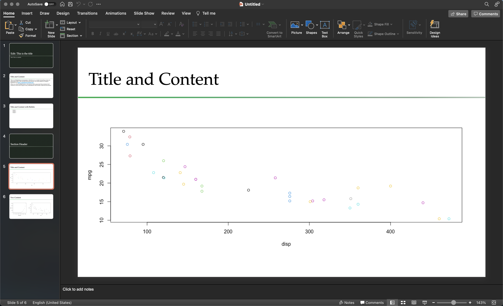

```{r, child="setup.Rmd", echo=FALSE}
```

# You did something cool

<br>

# And you want/need to show it to someone

---

# and you want to do it using rmarkdown to increase reproducibility

---

You may use

- xaringan
- revealjs
- Beamer
- ioslides

---

these work well for presentation, but can be difficult to share and collaborate with with non-R users

---

class: center, middle

# PowerPoint is the Goliath of presentation software

---

## There are 3 main ways to create pptx from R

- using {rmarkdown} via pandoc
- using {officedown}
- using {officer}

---


## There are 3 main ways to create pptx from R

- **using {rmarkdown} via pandoc**
- using {officedown}
- using {officer}

---

# powerpoint_presentation

This is a very simple slide setup

- Title Slide
- Title and Content (main content slide)
- Section Header
- Two Content

---

.pull-left[
````markdown
---
title: "Title Slide"
author: "Emil Hvitfeldt"
date: "8/27/2021"
output: powerpoint_presentation
---
````
]

.pull-right[

]

---

.pull-left[

````markdown
`r ''````{r setup, include=FALSE}
knitr::opts_chunk$set(echo = FALSE)
```

## Title and Content

This is an R Markdown presentation. Markdown 
is a simple formatting syntax for authoring 
HTML, PDF, and MS Word documents. For more 
details on using R Markdown see 
<http://rmarkdown.rstudio.com>.

When you click the **Knit** button a document
will be generated that includes both content 
as well as the output of any embedded R code 
chunks within the document.
````

]
.pull-right[

]

---

.pull-left[
````markdown
## Title and Content with Bullets

- Bullet 1
- Bullet 2
- Bullet 3
````
]

.pull-right[

]

---

.pull-left[
````markdown
# Section Header
````
]

.pull-right[

]

---

.pull-left[
````markdown
## Title and Content

`r ''````{r}
plot(mpg ~ disp, col = hp, data = mtcars)
```
````
]

.pull-right[

]

---

.pull-left[
````markdown
## Two Content

:::::: {.columns}
::: {.column}

`r ''````{r}
plot(pressure)
```

:::
::: {.column}

`r ''````{r}
plot(mpg ~ disp, data = mtcars)
```

:::
::::::
````
]

.pull-right[

]

---

# pptxtemplates

```{r, eval=FALSE}
# install.packages("devtools")
devtools::install_github("EmilHvitfeldt/pptxtemplates")
```

---

.center[

]

---

````markdown

---
title: "Edit: This is the title"
subtitle: "Edit: This is a subtitle"
output: 
  powerpoint_presentation:
    reference_doc: "reference_doc.pptx"
---

`r ''````{r setup, include=FALSE}
library(knitr)
knitr::opts_chunk$set(echo = FALSE)

library(pptxtemplates)

content_dimensions <- pptx_content_dimensions("reference_doc.pptx")

opts_template$set(
  full = content_dimensions$full,
  left = content_dimensions$left,
  right = content_dimensions$right
)
```

````

---

# Plot sizing

````markdown
`r ''````{r, opts.label="full"}
plot(mpg ~ disp, col = hp, data = mtcars)
```
````

---


---


---


---


---



---


---

clas:: center

Thank you!


# Thank you!

### `r icons::fontawesome("github")` [EmilHvitfeldt](https://github.com/EmilHvitfeldt/)
### `r icons::fontawesome("twitter")` [@Emil_Hvitfeldt](https://twitter.com/Emil_Hvitfeldt)
### `r icons::fontawesome("linkedin")` [emilhvitfeldt](linkedin.com/in/emilhvitfeldt/)
### `r icons::fontawesome("laptop")` [https://www.emilhvitfeldt.com/](https://www.emilhvitfeldt.com/)

Slides created via the R package [xaringan](https://github.com/yihui/xaringan).

