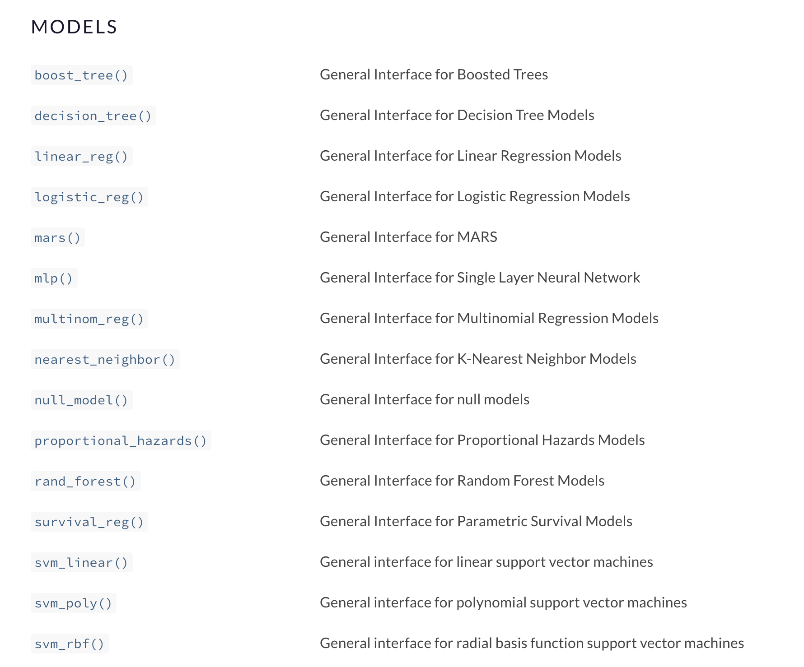
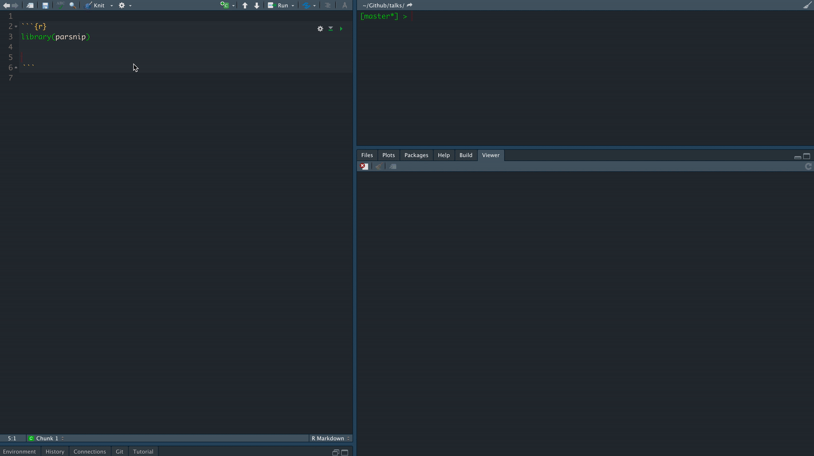
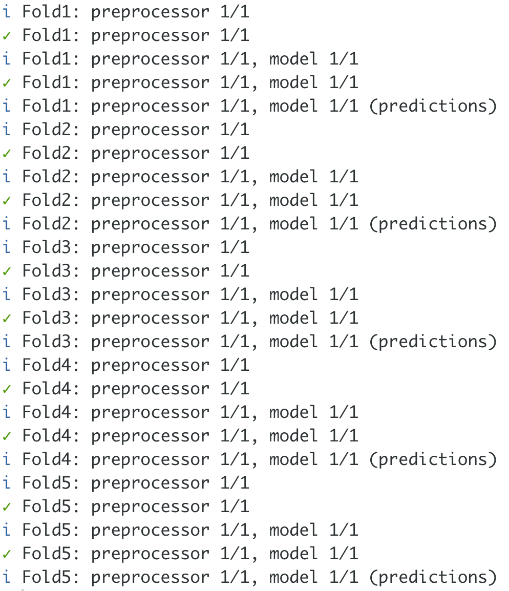
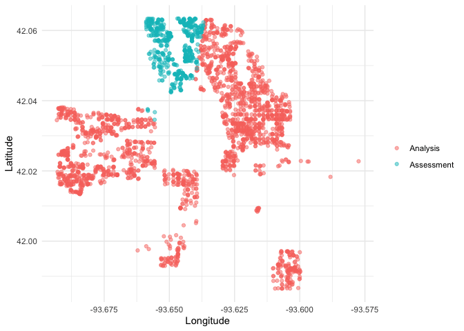

```{r, child="setup.Rmd", echo=FALSE, include=FALSE}
```
      
# About Me

- Data Analyst at Teladoc Health
- Adjunct Professor at American University teaching statistical machine learning using {tidymodels}
- R package developer, about 10 packages on CRAN (textrecipes, themis, paletteer, prismatic, textdata)
- Co-author of "Supervised Machine Learning for Text Analysis in R" with Julia Silge
- Located in sunny California
- Has 3 cats; Presto, Oreo, and Wiggles

---

background-image: url(images/cats.png)
background-position: center
background-size: contain

---

background-image: url(hex/tidymodels.png)
background-position: 90% 20%
background-size: 250px

# What is {tidymodels}?

- A collection of many packages
- Focused on modeling and machine learning
- Using tidymodels principles

---

class: center

# Core packages

rsample  
parsnip  
recipes  
tune  
workflows  
yardstick  
dials  
broom  

---

background-image: url(diagrams/model.png)
background-position: center
background-size: contain

---

background-image: url(diagrams/model-evaluate.png)
background-position: center
background-size: contain

---

background-image: url(diagrams/preprocess-model-evaluate.png)
background-position: center
background-size: contain

---

background-image: url(diagrams/split-preprocess-model-evaluate.png)
background-position: center
background-size: contain

---

background-image: url(diagrams/full-game.png)
background-position: center
background-size: contain

---

background-image: url(diagrams/full-game-parsnip.png)
background-position: center
background-size: contain

---

# User-facing problems in modeling in R

- Data must be a matrix (except when it needs to be a data.frame)
- Must use formula or x/y (or both)
- Inconsistent naming of arguments (ntree in randomForest, num.trees in ranger)
- na.omit explicitly or silently
- May or may not accept factors

---

# Syntax for Computing Predicted Class Probabilities

|Function     |Package      |Code                                       |
|:------------|:------------|:------------------------------------------|
|`lda`        |`MASS`       |`predict(obj)`                             |
|`glm`        |`stats`      |`predict(obj, type = "response")`          |
|`gbm`        |`gbm`        |`predict(obj, type = "response", n.trees)` |
|`mda`        |`mda`        |`predict(obj, type = "posterior")`         |
|`rpart`      |`rpart`      |`predict(obj, type = "prob")`              |
|`Weka`       |`RWeka`      |`predict(obj, type = "probability")`       |
|`logitboost` |`LogitBoost` |`predict(obj, type = "raw", nIter)`        |

---

## The goals of `parsnip` is...  

- Decouple the .blue[model classification] from the .orange[computational engine]
- Separate the definition of a model from its evaluation
- Harmonize argument names
- Make consistent predictions (always tibbles with `na.omit = FALSE`)

---

# Parsnip usage

```{r, warning=FALSE}
linear_spec <- lm(mpg ~ disp + drat + qsec, data = mtcars)
```

---

# Parsnip usage

.pull-left[
```{r}
library(parsnip)  
linear_spec <- linear_reg() %>%  
  set_mode("regression") %>%  
  set_engine("lm")  
linear_spec

```
]

.pull-right[
```{r, warning=FALSE}
fit_lm <- linear_spec %>%
  fit(mpg ~ disp + drat + qsec, data = mtcars)
fit_lm
```
]

---

# Tidy prediction

.pull-left[
Consistent Predictions
]

.pull-right[
```{r}
predict(fit_lm, mtcars)
```
]

---

# Parsnip models

.center[

]


---

.center[

]

---

background-image: url(diagrams/full-game-broom.png)
background-position: center
background-size: contain

---

# broom

broom summarizes key information about models in tidy `tibble()`s. 
broom provides three verbs to make it convenient to interact with model objects:

- `tidy()` summarizes information about model components
- `glance()` reports information about the entire model
- `augment()` adds information about observations to a data set

---

# lm fit object

```{r}
fit_lm$fit
```

---

# lm fit object

```{r}
summary(fit_lm$fit)
```

---

# lm fit object

```{r}
coefficients(fit_lm$fit)
```

---

# lm fit object

```{r}
tidy(fit_lm)
```

---

# lm fit object

```{r}
glance(fit_lm)
```

---

# lm fit object

```{r}
augment(fit_lm, new_data = mtcars[1:5, ])
```

---

background-image: url(diagrams/full-game-yardstick.png)
background-position: center
background-size: contain

---

# yardstick

You now have a model that can produce prediction

How do you measure the performance?

---

# Yardstick

Classification data

```{r}
data(two_class_example, package = "modeldata")

two_class_example
```

---

# Performance metrics

```{r, message=FALSE}
two_class_example %>%
  accuracy(truth = truth, estimate = predicted)
```

```{r}
two_class_example %>%
  specificity(truth = truth, estimate = predicted)
```

```{r}
two_class_example %>%
  sensitivity(truth = truth, estimate = predicted)
```


---

# Performance metrics

```{r}
my_metrics <- metric_set(accuracy, specificity, sensitivity)

two_class_example %>%
  my_metrics(truth = truth, estimate = predicted)
```

---

# Performance metrics

```{r}
my_metrics <- metric_set(accuracy, specificity, sensitivity)

two_class_example %>%
  group_by(group = row_number() %% 3) %>%
  my_metrics(truth = truth, estimate = predicted)
```

---

# Performance metrics

```{r}
two_class_example %>%
  roc_curve(truth, Class1)
```

---

# Performance metrics

```{r}
roc_curve(two_class_example, truth, Class1) %>%
  autoplot()
```

---

# Performance metrics

```{r}
two_class_example %>%  
  group_by(group = row_number() %% 3) %>%
  roc_curve(truth, Class1) %>%
  autoplot()
```

---

background-image: url(diagrams/full-game-rsample.png)
background-position: center
background-size: contain

---

# rsample

Spending our data carefully and efficiently

---

# penguins

```{r}
library(palmerpenguins)
penguins
```

---

# Validation split

```{r}
set.seed(1234)
penguins_split <- initial_split(penguins, prop = 0.7, strata = species)

penguins
```

---

# Validation split

```{r}
set.seed(1234)
penguins_split <- initial_split(penguins, prop = 0.7, strata = species)

penguins_train <- training(penguins_split)
penguins_test <- testing(penguins_split)

penguins_train
```

---

# Bootstrapping

```{r}
penguins_boots <- bootstraps(penguins_train, times = 1000)
penguins_boots
```

---

# Bootstrapping

```{r}
penguins_boots <- bootstraps(penguins_train, times = 1000)
```

```{r}
lobstr::obj_size(penguins_train)
```

```{r}
lobstr::obj_size(penguins_boots)
```

---

# Cross-Validation

```{r}
penguins_boots <- vfold_cv(penguins_train)
penguins_boots
```

---

background-image: url(diagrams/full-game-recipes.png)
background-position: center
background-size: contain

---

# recipes


## What happens to the data between `read_data()` and `fit_model()`?

---

## Prices of 54,000 round-cut diamonds

```{r}
library(ggplot2)
diamonds
```

---

## Formula expression in modeling

```{r}
model <- lm(price ~ cut:color + carat + log(depth), 
            data = diamonds)
```

- Select .orange[outcome] & .blue[predictors]

---

## Formula expression in modeling

```{r}
model <- lm(price ~ cut:color + carat + log(depth), 
            data = diamonds)
```

- Select outcome & predictors
- .orange[Operators] to matrix of predictors

---

## Formula expression in modeling

```{r}
model <- lm(price ~ cut:color + carat + log(depth), 
            data = diamonds)
```

- Select outcome & predictors
- Operators to matrix of predictors
- .orange[Inline functions]

---

## Work under the hood - model.matrix

```{r, eval=FALSE}
model.matrix(price ~ cut:color + carat + log(depth) + table, 
             data = diamonds)
```

```{r, echo=FALSE, output.lines=13}
dplyr::glimpse(as.data.frame(model.matrix(price ~ cut:color + carat + log(depth) + table, 
             data = diamonds)), 80)
```
  
---

## Downsides

- **Tedious typing with many variables**

---

## Downsides

- Tedious typing with many variables
- **Functions have to manually be applied to each variable**

```{r, eval=FALSE}
lm(y ~ log(x01) + log(x02) + log(x03) + log(x04) + log(x05) + log(x06) + log(x07) +
       log(x08) + log(x09) + log(x10) + log(x11) + log(x12) + log(x13) + log(x14) + 
       log(x15) + log(x16) + log(x17) + log(x18) + log(x19) + log(x20) + log(x21) + 
       log(x22) + log(x23) + log(x24) + log(x25) + log(x26) + log(x27) + log(x28) + 
       log(x29) + log(x30) + log(x31) + log(x32) + log(x33) + log(x34) + log(x35),
   data = dat)
```

---

## Downsides

- Tedious typing with many variables
- Functions have to manually be applied to each variable
- **Operations are constrained to single columns**

```{r, eval=FALSE}
# Not possible
lm(y ~ pca(x01, x02, x03, x04, x05), data = dat)
```

---

## Downsides

- Tedious typing with many variables
- Functions have to manually be applied to each variable
- Operations are constrained to single columns
- **Everything happens at once**

You can't apply multiple transformations to the same variable.

---

## Downsides

- Tedious typing with many variables
- Functions have to manually be applied to each variable
- Operations are constrained to single columns
- Everything happens at once
- **Connected to the model, calculations are not saved between models**

One could manually use `model.matrix` and pass the result to the modeling function.

---

# Recipes

New package to deal with this problem

### Benefits:

- **Modular**

---

# Recipes

New package to deal with this problem

### Benefits:

- Modular
- **pipeable**

---

# Recipes

New package to deal with this problem

### Benefits:

- Modular
- pipeable
- **Deferred evaluation**

---

# Recipes

New package to deal with this problem

### Benefits:

- Modular
- pipeable
- Deferred evaluation
- **Isolates test data from training data**

---

# Recipes

New package to deal with this problem

### Benefits:

- Modular
- pipeable
- Deferred evaluation
- Isolates test data from training data
- **Can do things formulas can't**


---

# Modularity and pipeability

```{r, eval=FALSE}
price ~ cut + color + carat + log(depth) + table
```

Taking the formula from before we can rewrite it as the following recipe

```{r, eval=FALSE}
rec <- recipe(price ~ cut + color + carat + depth + table, 
              data = diamonds) %>%
  step_log(depth) %>%
  step_dummy(cut, color)
```

---

# Modularity and pipeability

```{r, eval=FALSE}
price ~ cut + color + carat + log(depth) + table
```

Taking the formula from before we can rewrite it as the following recipe

```{r, eval=FALSE}
rec <- recipe(price ~ cut + color + carat + depth + table, 
              data = diamonds) %>%
  step_log(depth) %>%
  step_dummy(cut, color)
```

.orange[formula] expression to specify variables

---

# Modularity and pipeability

```{r, eval=FALSE}
price ~ cut + color + carat + log(depth) + table
```

Taking the formula from before we can rewrite it as the following recipe

```{r}
rec <- recipe(price ~ cut + color + carat + depth + table, 
              data = diamonds) %>%
  step_log(depth) %>%
  step_dummy(cut, color)
```

then apply .orange[log] transformation on `depth`

---

# Modularity and pipeability

```{r, eval=FALSE}
price ~ cut + color + carat + log(depth) + table
```

Taking the formula from before we can rewrite it as the following recipe

```{r, eval=FALSE}
rec <- recipe(price ~ cut + color + carat + depth + table, 
              data = diamonds) %>%
  step_log(depth) %>%
  step_dummy(cut, color)
```

lastly we create .orange[dummy variables] from `cut` and `color`

---

## Deferred evaluation

If we look at the recipe we created we don't see a dataset, but instead, we see a specification

```{r}
rec
```

---

## Deferred evaluation

**recipes** gives a specification of the intent of what we want to do.

No calculations have been carried out yet.

First, we need to `prep()` the recipe. This will calculate the sufficient statistics needed to perform each of the steps. 

```{r}
prepped_rec <- prep(rec)
```

---

## Deferred evaluation

```{r}
prepped_rec
```

---

# Baking

After we have prepped the recipe we can `bake()` it to apply all the transformations

```{r, eval=FALSE}
bake(prepped_rec, new_data = diamonds)
```

```{r, echo=FALSE, output.lines=10}
dplyr::glimpse(bake(prepped_rec, new_data = diamonds), 80)
```

---

# Baking / Juicing

Since the dataset is already calculated after running `prep()` can we use `juice()` to extract it

```{r, eval=FALSE}
juice(prepped_rec)
```

```{r, echo=FALSE, output.lines=10}
dplyr::glimpse(juice(prepped_rec), 80)
```

---

.center[
# recipes workflow
]

<br>
<br>
<br>
.huge[
.center[
```{r, eval=FALSE}
recipe -> prepare -> bake/juice

(define) -> (estimate) -> (apply)
```
]
]

---

## Isolates test & training data

When working with data for predictive modeling it is important to make sure any information from the test data leaks into the training data.

This is avoided by using **recipes** by making sure you only prep the recipe with the training dataset.

---

# Can do things formulas can't

---

# selectors

.pull-left[
It can be annoying to manually specify variables by name.

The use of selectors can greatly help you!
]

.pull-right[
```{r}
rec <- recipe(price ~ ., data = diamonds) %>%
  step_dummy(all_nominal()) %>%
  step_zv(all_numeric()) %>%
  step_center(all_predictors())
```
]

---

# selectors

.pull-left[
.orange[`all_nominal()`] is used to select all the nominal variables. 
]

.pull-right[
```{r}
rec <- recipe(price ~ ., data = diamonds) %>%
  step_dummy(all_nominal()) %>%
  step_zv(all_numeric()) %>%
  step_center(all_predictors())
```
]

---

# selectors

.pull-left[
.orange[`all_numeric()`] is used to select all the numeric variables. 

Even the ones generated by .blue[`step_dummy()`]
]

.pull-right[
```{r}
rec <- recipe(price ~ ., data = diamonds) %>%
  step_dummy(all_nominal()) %>%
  step_zv(all_numeric()) %>%
  step_center(all_predictors())
```
]

---

# selectors

.pull-left[
.orange[`all_predictors()`] is used to select all predictor variables. 

Will not break even if a variable is removed with .blue[`step_zv()`]
]

.pull-right[
```{r}
rec <- recipe(price ~ ., data = diamonds) %>%
  step_dummy(all_nominal()) %>%
  step_zv(all_numeric()) %>%
  step_center(all_predictors())
```
]

---

# Roles

.pull-left[
.orange[`update_role()`] can be used to give variables roles.

That then can be selected with .blue[`has_role()`]

Roles can also be set with `role = ` argument inside steps
]

.pull-right[
```{r}
rec <- recipe(price ~ ., data = diamonds) %>%
  update_role(x, y, z, new_role = "size") %>%
  step_log(has_role("size")) %>%
  step_dummy(all_nominal()) %>%
  step_zv(all_numeric()) %>%
  step_center(all_predictors())
```
]

---

## PCA extraction

```{r}
rec <- recipe(price ~ ., data = diamonds) %>%
  step_dummy(all_nominal()) %>%
  step_scale(all_predictors()) %>%
  step_center(all_predictors()) %>%
  step_pca(all_predictors(), threshold = 0.8)
```

You can also write a recipe that extract enough .orange[principal components] to explain .blue[80% of the variance]

Loadings will be kept in the prepped recipe to make sure other datasets are transformed correctly

---

background-image: url(diagrams/full-game-workflows.png)
background-position: center
background-size: contain

---

# Workflows

Simple package that helps us formulate more about what happens to our model.

Main functions are `workflow()`, `add_model()`, `add_formula()` or `add_variables()` (we will see `add_recipe()` later in the course)

```{r}
library(workflows)

linear_wf <- workflow() %>%
  add_model(linear_spec) %>%
  add_formula(mpg ~ disp + hp + wt)
```

---

# Workflows

This allows up to combine the model with what variables it should expect

.pull-left[
```{r, eval=FALSE}
library(workflows)

linear_wf <- workflow() %>%
  add_model(linear_spec) %>%
  add_formula(mpg ~ disp + hp + wt)
linear_wf
```
]

.pull-right[
```{r, echo=FALSE}
library(workflows)

linear_wf <- workflow() %>%
  add_model(linear_spec) %>%
  add_formula(mpg ~ disp + hp + wt)
linear_wf
```
]

---

`add_variables()` allows for a different way of specifying the the response and predictors in our model

# Workflows

.pull-left[
```{r, eval=FALSE}
library(workflows)

linear_wf <- workflow() %>%
  add_model(linear_spec) %>%
  add_variables(outcomes = mpg,
                predictors = c(disp, hp, wt))
linear_wf
```
]

.pull-right[
```{r, echo=FALSE}
library(workflows)

linear_wf <- workflow() %>%
  add_model(linear_spec) %>%
  add_variables(outcomes = mpg,
                predictors = c(disp, hp, wt))
linear_wf
```
]

---

# Workflows

You can use a `workflow` just like a parsnip object and fit it directly

```{r}
fit(linear_wf, data = mtcars)
```

---

background-image: url(diagrams/full-game-tune.png)
background-position: center
background-size: contain

---

# Tune

We introduce the **tune** package. This package helps us fit many models in a controlled manner in the tidymodels framework. It relies heavily on parsnip and rsample

---

# Tune

We can use `fit_resamples()` to fit the workflow we created within each resample

```{r}
library(tune)
mtcars_folds <- vfold_cv(mtcars, v = 4)

linear_fold_fits <- fit_resamples(
    linear_wf,
    resamples = mtcars_folds
)
```

---

# Tune

The results of this resampling comes as a data.frame

```{r}
linear_fold_fits
```

---

# Tune

`collect_metrics()` can be used to extract the CV estimate

```{r}
collect_metrics(linear_fold_fits)
```

---

# Tune

Setting `summarize = FALSE` in `collect_metrics()` Allows us the see the individual performance metrics for each fold

```{r}
collect_metrics(linear_fold_fits, summarize = FALSE)
```

---


.pull-left[
# Tune

There are some settings we can set with `control_resamples()`.

One of the most handy ones (IMO) is `verbose = TRUE`

```{r, eval=FALSE}
library(tune)

linear_fold_fits <- fit_resamples(
  linear_wf,
  resamples = mtcars_folds,
  control = control_resamples(verbose = TRUE)
)
```
]

.pull-right[
.center[

]
]

---

# Tune

We can also directly specify the metrics that are calculated within each resample

```{r}
library(tune)

linear_fold_fits <- fit_resamples(
    linear_wf,
    resamples = mtcars_folds, 
    metrics = metric_set(rmse, rsq, mase)
)

collect_metrics(linear_fold_fits)
```

---

background-image: url(diagrams/full-game-dials.png)
background-position: center
background-size: contain

---

# dials

What if we want to tune hyperparameters?

---

# Lasso spec

```{r}
lasso_spec <- linear_reg(mixture = 1, penalty = tune()) %>%
  set_mode("regression") %>%
  set_engine("glmnet")
```

```{r}
rec_spec <- recipe(mpg ~ ., 
                   data = mtcars) %>%
  step_normalize(all_predictors())
```

And we combine these two into a `workflow`

```{r}
lasso_wf <- workflow() %>%
  add_model(lasso_spec) %>%
  add_recipe(rec_spec)
```

---

# Hyperparameter Tuning

We also need to specify what values of the hyperparameters we are trying to tune we want to calculate. Since the lasso model can calculate all paths at once let us get back 50 evenly spaced values of $\lambda$

```{r}
lambda_grid <- grid_regular(penalty(), levels = 50)
lambda_grid
```

---

# Hyperparameter Tuning

We combine these things in `tune_grid()` which works much like `fit_resamples()` but takes a `grid` argument as well

```{r}
tune_rs <- tune_grid(
  object = lasso_wf,
  resamples = mtcars_folds,
  grid = lambda_grid
)
```

---

# Hyperparameter Tuning

We can see how each of the values of $\lambda$ is doing with `collect_metrics()`

```{r}
collect_metrics(tune_rs)
```

---

# Hyperparameter Tuning

.pull-left[
And there is even a plotting method that can show us how the different values of the hyperparameter are doing
]

.pull-right[
```{r}
autoplot(tune_rs)
```
]

---

# Hyperparameter Tuning

Look at the best performing one with `show_best()` and select the best with `select_best()`

```{r}
tune_rs %>%
  show_best("rmse")
```

```{r}
best_rmse <- tune_rs %>%
  select_best("rmse")
```

---

# Hyperparameter Tuning

Remember how the specification has `penalty = tune()`?

```{r}
lasso_wf
```

---

# Hyperparameter Tuning

We can update it with `finalize_workflow()`

```{r}
final_lasso <- finalize_workflow(lasso_wf, best_rmse)
final_lasso
```

---

# Hyperparameter Tuning

And this finalized specification can now we can fit using the whole training data set.

```{r}
fitted_lasso <- fit(final_lasso, mtcars)
```

---

class: center

# What now?

---

# Each of these packages are created to allow for easy extensions

---

background-image: url(images/parsnip-extensions.png)
background-position: center
background-size: contain

# parsnip extensions

https://www.tidymodels.org/learn/develop/models/

- *discrim* discriminant analysis models
- *poissonreg* Poisson regression models
- *rules* rule-based models
- *baguette* bagging ensemble models
- *plsmod*  linear projection model
- *modeltime* time series forecast models
- *treesnip* tree, lightGBM, and Catboost
- *censored* censored regression and survival analysis models

---

# broom extensions

https://www.tidymodels.org/learn/develop/broom/

- *broomstick* decision tree methods
- *tidytext* corpus, LDA, topic models
- *sweep*  time series forecasting
- *broom.mixed* mixed models

---

# yardstick extensions

https://www.tidymodels.org/learn/develop/metrics/

---

# rsample extensions

- *spatialsample* spatial resampling

.center[

]

---

# recipes extensions

https://www.tidymodels.org/learn/develop/recipes/

- *embed* categorical predictor embeddings
- *timetk* time series data
- *textrecipes* preprocessing text
- *themis* unbalanced data

---

# workflows extensions

- *workflowsets* 

create a workflow set that holds multiple workflow object

---

# tune extensions

- *finetune*


- Efficient grid search via racing with ANOVA models
- Efficient grid search via racing with win/loss statistics
- Optimization of model parameters via simulated annealing

---

# Other

- *stacks* model stacking
- *probably* Post-Processing Class Probability Estimates
- *butcher* reduce the size of model objects
- *modeldb* Fit models inside the database
- *tidypredict* predictions inside databases

---

# Resources

https://www.tidymodels.org/

https://www.tmwr.org/

https://juliasilge.com/

https://emilhvitfeldt.github.io/ISLR-tidymodels-labs/index.html

---

class: center, middle

# Thank you!

### `r icon::fa("github")` [EmilHvitfeldt](https://github.com/EmilHvitfeldt/)
### `r icon::fa("twitter")` [@Emil_Hvitfeldt](https://twitter.com/Emil_Hvitfeldt)
### `r icon::fa("linkedin")` [emilhvitfeldt](linkedin.com/in/emilhvitfeldt/)
### `r icon::fa("laptop")` [www.hvitfeldt.me](www.hvitfeldt.me)

Slides created via the R package [xaringan](https://github.com/yihui/xaringan).

