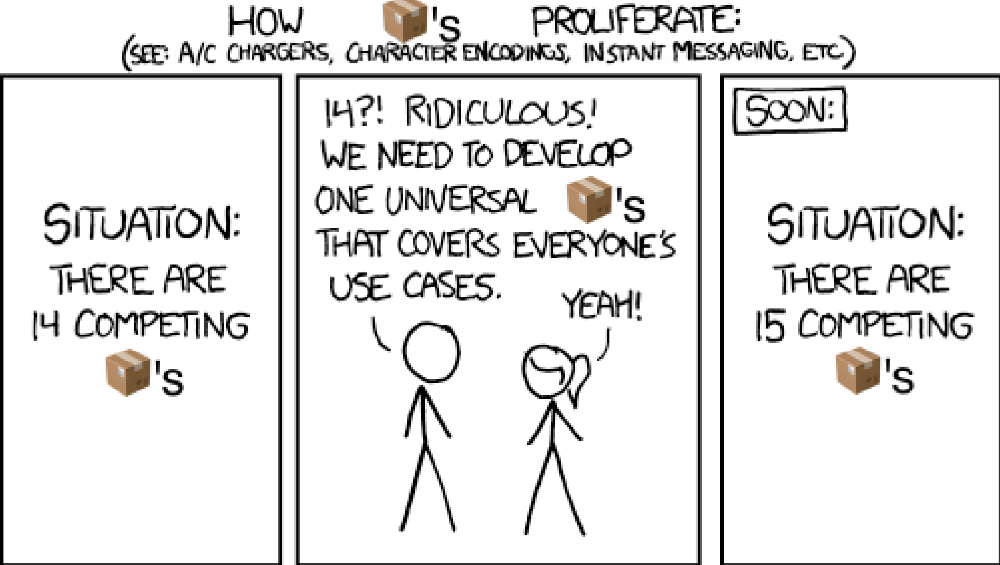
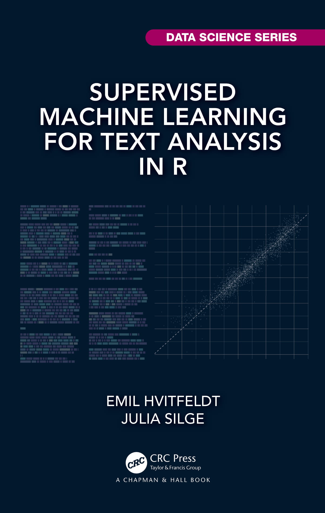

background-image: url(images/title.png)
background-position: center
background-size: cover

<h1 id="text-preprocessing-in-r" style="
    position: absolute;
    left: 5%;
    top: 15%;
    color: #c5d8d5;
    font-size: 60px;
    -webkit-text-stroke: 2px black;
">Text Preprocessing in R</h1>

<h1 id="new-york-r" style="
    position: absolute;
    right: 5%;
    top: 39%;
    color: #f6f4c6;
    font-size: 60px;
    -webkit-text-stroke: 2px black;
">New York R</h1>

<h1 id="text-preprocessing-in-r" style="
    position: absolute;
    left: 5%;
    top: 61%;
    color: #fbf1d4;
    font-size: 60px;
    -webkit-text-stroke: 2px black;
">Emil Hvitfeldt</h1>

---

class: bg-right, bg1

```{r, child="setup.Rmd", echo=FALSE, include=FALSE}
```
      
# About Me

.pull-left.w80[
- Data Analyst at Teladoc Health
- Adjunct Professor at American University teaching statistical machine learning using {tidymodels}
- R package developer, almost a dozen packages CRAN (textrecipes, themis, paletteer, prismatic, textdata)
- Co-author of "Supervised Machine Learning for Text Analysis in R" with Julia Silge
- Located in sunny California
- Has 3 cats; Presto, Oreo, and Wiggles
]

---

background-image: url(images/cats.png)
background-position: center
background-size: contain

---

class: bg-corners, bg1, middle

.pull-right.w80[
.pull-left.w90[
<p style="font-size: 40pt;">
Most of data science is counting, and sometimes dividing
</p>

<cite>Hadley Wickham</cite>
]
]

---

class: bg-corners, bg1, middle

.pull-right.w80[
.pull-left.w90[
<p style="font-size: 40pt;">
Most of <s>data science</s> <b>text preprocessing</b> is counting, and sometimes dividing
</p>

<cite><s>Hadley Wickham</s> Emil Hvitfeldt</cite>
]
]

---

class: bg-full, bg1, middle, center

<div style="font-size: 80pt;">
What are we counting?
</div>

```{css, echo=FALSE}
.animal {
  font-size: 31pt;
}

.hl1 {
  text-decoration: underline;
  text-decoration-color: #FF9A4D;
}

.hl2 {
  text-decoration: underline;
  text-decoration-color: #F94DFF;
}
```

---

class: bg-corners, bg1

.animal[
Beavers are most well known for their distinctive home-building that can be seen in rivers and streams. The beavers dam is built from twigs, sticks, leaves and mud and are surprisingly strong. Here the beavers can catch their food and swim in the water.
Beavers are nocturnal animals existing in the forests of Europe and North America (the Canadian beaver is the most common beaver). Beavers use their large, flat shaped tails, to help with dam building and it also allows the beavers to swim at speeds of up to 30 knots per hour. The beaver's significance is acknowledged in Canada by the fact that there is a Canadian Beaver on one of their coins.
]

---

class: bg-corners, bg1

.animal[
.hl1[Beavers are most well known for their distinctive home-building that can be seen in rivers and streams.] .hl2[The beavers dam is built from twigs, sticks, leaves and mud and are surprisingly strong.] .hl1[Here the beavers can catch their food and swim in the water.]
.hl2[Beavers are nocturnal animals existing in the forests of Europe and North America (the Canadian beaver is the most common beaver).] .hl1[Beavers use their large, flat shaped tails, to help with dam building and it also allows the beavers to swim at speeds of up to 30 knots per hour.] .hl2[The beaver's significance is acknowledged in Canada by the fact that there is a Canadian Beaver on one of their coins.]
]

---

class: bg-corners, bg1


```{r, echo=FALSE}
beavers <- "Beavers are most well known for their distinctive home-building that can be seen in rivers and streams. The beavers dam is built from twigs, sticks, leaves and mud and are surprisingly strong. Here the beavers can catch their food and swim in the water. Beavers are nocturnal animals existing in the forests of Europe and North America (the Canadian beaver is the most common beaver). Beavers use their large, flat shaped tails, to help with dam building and it also allows the beavers to swim at speeds of up to 30 knots per hour. The beaver's significance is acknowledged in Canada by the fact that there is a Canadian Beaver on one of their coins."
```

.animal[
`r gsub(".hl[12]{1}\\[ \\]", " ", paste0(c(".hl1[", ".hl2["), strsplit(beavers, "")[[1]], "]", collapse = ""))`
]

---

class: bg-corners, bg1

.animal[
`r gsub(".hl[12]{1}\\[ \\]", " ", paste0(c(".hl1[", ".hl2["), strsplit(beavers, "\\s")[[1]], "] ", collapse = ""))`
]

---

class: bg-corners, bg1, center, middle

# Disclaimer

--

I'll show examples in English  

--

English is not the only language out there #BenderRule

--

The difficulty of different tasks vary from language to language  

--

langauge != text

---

class: bg-left, bg1

.pull-right.w80[
# Goal

Turn .blue[text] into .pink[numbers]

<br>

turning the .blue[text] into .pink[something machine readable]

there *will* be a loss along the way

the same way there is a loss from speech to text
]

---

class: bg-left, bg1, middle

.pull-right.w80[
.pull-left.w90[
<p style="font-size: 40pt;">
What I'll be talking about will be langauge/implementatation agnostic
</p>

]
]

---

class: bg-corners, bg1

.center[
# Existing packages
]

.pull-left[
.center[
## tidytext
]

great for EDA and topic modeling
]

.pull-right[
.center[
## quanteda
]

Whole ecosystem, end to end
]

---

class: bg-corners, bg1

.center[
## {textrecipes}
]

.pull-left[
- strictly text preprocessing / feature engineering


- part of recipes/tidymodels


- doesn't create any custom object


- It doesn't restrict us to only use text as features
]

.pull-right[
.center[

]
]

---

.center[

]

---

class: bg-right, bg1, middle

## tidytext doesn't work

<br>

## quanteda is its own ecosystem

<br>

##learn transformation and apply to new data

---

class: bg-corners, bg1

.pull-right.w80[
# Scope

We are limiting this to tabular data

I would rather get a good foundation then work with the cutting edge 
]


---

# Full recipe

```{r}
library(animals)
library(recipes)
library(textrecipes)

rec_spec <- recipe(diet ~ ., data = animals) %>%
  step_novel(lifestyle) %>% #<<
  step_unknown(lifestyle) %>% #<<
  step_other(lifestyle, threshold = 0.01) %>% #<<
  step_dummy(lifestyle) %>% #<<
  step_log(mean_weight) %>% #<<
  step_impute_mean(mean_weight) %>% #<<
  step_text_normalization(text) %>%
  step_tokenize(text) %>%
  step_stopwords(text) %>%
  step_tokenfilter(text, max_tokens = 500, min_times = 5) %>%
  step_tfidf(text)
```

---

# Full recipe

```{r}
library(animals)
library(recipes)
library(textrecipes)

rec_spec <- recipe(diet ~ ., data = animals) %>%
  step_novel(lifestyle) %>%
  step_unknown(lifestyle) %>%
  step_other(lifestyle, threshold = 0.01) %>%
  step_dummy(lifestyle) %>% 
  step_log(mean_weight) %>%
  step_impute_mean(mean_weight) %>%
  step_text_normalization(text) %>% #<<
  step_tokenize(text) %>% #<<
  step_stopwords(text) %>% #<<
  step_tokenfilter(text, max_tokens = 500, min_times = 5) %>% #<<
  step_tfidf(text) #<<
```


---

class: bg-full, bg2, middle, center

<div style="font-size: 110pt;">
TOKENIZATION
</div>

---

class: bg-corners, bg2, middle, right

<div style="font-size: 50pt;">
we want to take out blob of text and turn it into something smaller
</div>

<br>

.left[
<div style="font-size: 50pt;">
something that we can count
</div>
]

---

class: bg-right, bg2

# Tokenization

.pull-left.w80[
- An essential part of most text analyses
- Most common token == word, but sometimes we tokenize in a different way
- Many options to take into consideration 

We are extremely fortunate that splitting by .pink[white-space] works as a good baseline for English
]

---

class: bg-corners, bg2

# White spaces tokenization

```{r}
strsplit(beaver, "\\s")[[1]]
```

---

class: bg-corners, bg2

# Tokenization: {tokenizers} package

```{r}
tokenizers::tokenize_words(animals$text[74])
```

---

class: bg-right, bg2

# word boundary algorithm (ICU)

<div style="font-size: 11pt;">
- Break at the start and end of text, unless the text is empty.
- Do not break within CRLF (new line characters).
- Otherwise, break before and after new lines (including CR and LF).
- Do not break within emoji zwj sequences.
- Keep horizontal whitespace together.
- Ignore Format and Extend characters, except after sot, CR, LF, and new line.
- Do not break between most letters.
- Do not break letters across certain punctuation.
- Do not break within sequences of digits, or digits adjacent to letters (“3a,” or “A3”).
- Do not break within sequences, such as “3.2” or “3,456.789.”
- Do not break between Katakana.
- Do not break from extenders.
- Do not break within emoji flag sequences.
- Otherwise, break everywhere (including around ideographs).

???

finding word boundaries according to the specification from the International Components for Unicode (ICU)


---

class: bg-right, bg2

# Tokenization considerations

- Should we turn UPPERCASE letters to lowercase?


--


- How should we handle punctuation`r emo::ji("interrobang")`


--


- What about non-word characters .blue[inside] words?


--


- Should compound words be split or multi-word ideas be kept together?

---

class: bg-corners, bg2

.pull-right.w80[
# Problems

```{r, eval=FALSE}
table(c("flowers", "bush", "flowers"))
```
]

---

class: bg-corners, bg2


.pull-right.w80[
# Problems

```{r, eval=TRUE}
table(c("flowers", "bush", "flowers"))
```
]
---

class: bg-corners, bg2

.pull-right.w80[
# Problems

```{r}
tokenize_characters("flowers")
```

Ligatures can sneak in everywhere!
]

---

class: bg-left, bg2

.pull-right.w80[
# Problems

This doesn't even begin to describe the difference between slang and domain knowledge

- wow
- wooow
- wooooow
- woooooooooow!!

the same word? are they different enough?
]

---

class: bg-right, bg2

# Problems

What about emojis?

Are emojis words?

- Lets get some some 🌮s
- I love you ❤️

---

class: bg-full, bg2, middle, center

<div style="font-size: 100pt;">
The domain you are in matters!
</div>

---

class: bg-corners, bg2

.pull-right.w90[
# {textrecipes}

{textrecipes} realizes that there are millions of ways to tokenize and won't tie you down to one.

Defaults to {tokenizers}

But you can pass in your own tokenizer

There are even bindings to other packages/languages

spacyr, tokenizers.bpe, udpipe with more to come
]

---

class: bg-right, bg2

# Default {tokenizers}

.pull-left.w80[
```{r}
rec <- recipe(~ text, data = animals) %>%
  step_tokenize(text)
```
]

---

class: bg-right, bg2

# Default {tokenizers}

.pull-left.w80[
```{r}
rec <- recipe(~ text, data = animals) %>%
  step_tokenize(text,
                options = list(strip_punct = FALSE,
                               lowercase = FALSE))
```
]

---

class: bg-right, bg2

# Custom tokenizer

.pull-left.w80[
```{r, eval=FALSE}
rec <- recipe(~ text, data = animals) %>%
  step_tokenize(text, 
                custom_token = my_amazing_tokenizer)
```
]

---

class: bg-right, bg2

# spacy via {spacyr}

.pull-left.w80[
```{r}
rec <- recipe(~ text, data = animals) %>%
  step_tokenize(text, engine = "spacyr")
```
]

---

class: bg-right, bg2

# {tokenizers.bpe}

.pull-left.w80[
```{r}
rec <- recipe(~ text, data = animals) %>%
  step_tokenize(text, 
                engine = "tokenizers.bpe",
                training_options = list(vocab_size = 1000))
```
]

---

class: bg-right, bg2

# {udpipe}

.pull-left.w80[
```{r, eval=FALSE}
library(udpipe)
udmodel <- udpipe_download_model(language = "english")

rec <- recipe(~ text, data = animals) %>%
  step_tokenize(text, engine = "udpipe", 
                training_options = list(model = udmodel))
```
]

---

class: bg-full, bg3, middle, center

<div style="font-size: 150pt;">
STEMMING
</div>

---

class: bg-full, bg3, middle, right

<div style="font-size: 100pt;">
Act of modifying tokens once they have become tokens
</div>


---

class: bg-right, bg3, middle

<div style="font-size: 70pt;">
- Porter Stemmer
- Ending s removal

---

class: bg-left, bg3, middle

.pull-right.w80[
<div style="font-size: 50pt;">
We are again combining buckets in the hope that they can be treated equally
</div>
]

---

class: bg-right, bg3

# Stemming Example

```{r, echo=FALSE}
library(tidyverse)
library(tidytext)

words <- c("colonies", "studies", "surprisingly", "distinctive", "building", "animals", "significance", "beaver")

animals %>%
  slice(74) %>%
  unnest_tokens(word, text) %>%
  filter(word %in% words) %>%
  distinct() %>%
  mutate(`Remove S` = str_remove(word, "s$"),
         `Plural endings` = case_when(str_detect(word, "[^e|aies$]ies$") ~
                                        str_replace(word, "ies$", "y"),
                                      str_detect(word, "[^e|a|oes$]es$") ~
                                        str_replace(word, "es$", "e"),
                                      str_detect(word, "[^ss$|us$]s$") ~
                                        str_remove(word, "s$"),
                                      TRUE ~ word),
         `Porter stemming` = SnowballC::wordStem(word)) %>%
  rename(`Original word` = word) %>%
  select(-diet, -lifestyle, -mean_weight)
```

---

class: bg-right, bg3

# Default {SnowballC}

.pull-left.w80[
```{r}
rec <- recipe(~ text, data = animals) %>%
  step_tokenize(text) %>%
  step_stem(text)
```
]

---

class: bg-right, bg3

# Custom Stemming function

.pull-left.w80[
```{r}
remove_s <- function(x) gsub("s$", "", x)

rec <- recipe(~ text, data = animals) %>%
  step_tokenize(text) %>%
  step_stem(text, custom_stemmer = remove_s)
```
]

---

class: bg-corners, bg3

.pull-right.w90[
# Lemmatization

Works a little stronger then stemming, will take a little while longer to run

Implementations:

- spacyr
- udpipe
]

---

class: bg-right, bg3

# spacy lemmatization

.pull-left.w80[
```{r}
rec <- recipe(~ text, data = animals) %>%
  step_tokenize(text, engine = "spacyr") %>%
  step_lemma(text)
```
]

---

class: bg-full, bg4, middle, center

<div style="font-size: 200pt;">
STOP WORDS
</div>

---

class: bg-corners, bg4

.center[
# Definitions from the Web
]

--

> "In natural language processing, useless words (data), are referred to as stop words."

<br>

--
 
> "In computing, stop words are words that are filtered out before or after the natural language data (text) are processed."

<br>

--

> "Stopwords are the words in any language which does not add much meaning to a sentence. They can safely be ignored without sacrificing the meaning of the sentence"

---

class: bg-swirl, bg4 
 
.center[
<span, style = 'font-size:400px;'>`r emo::ji("thinking")`</span>
]

---

class: bg-full, bg4, middle, right

<div style="font-size: 70pt;">
this gives the illusion that stop words are easy to work with and are without problems
</div>

---

class: bg-corners, bg4

.right[
<div style="font-size: 50pt;">
what is stop words really?
</div>
]

<br>

<div style="font-size: 40pt;">
Low information words that contribute little value to task
</div>

<br>

<div style="font-size: 40pt;">
The information of words lives on a continuum
</div>

---

.pull-left[
## Word information

Each rectangle represents a word in 1 document

We will illustrate the information that word carries with color.

<span, style = 'color:#3E049CFF;'>low information words</span> 

<span, style = 'color:#FCCD25FF;'>high information words</span>

]

.pull-right[
```{r, echo=FALSE, warning = FALSE, out.width="80%", fig.asp = 1.1}
library(ggpage)
tinderbox %>%
  ggpage_build() %>%
  ggpage_plot() +
  theme_void()
```
]

---

.pull-left[
## Word information

Uniform information

If this was true then it would hurt to remove any words

# `r emo::ji("thumbsdown")`
]

.pull-right[
```{r, echo=FALSE, warning = FALSE, out.width="80%", fig.asp = 1.1}
library(ggpage)
tinderbox %>%
  ggpage_build() %>%
  mutate(fill = 1) %>%
  ggpage_plot(aes(fill = fill)) +
  theme_void() +
  guides(fill = "none") +
  scale_fill_viridis_c(option = "C")
```
]

---

.pull-left[
## Word information

Random information

No way to figure out which words to remove

# `r emo::ji("thumbsdown")`
]

.pull-right[
```{r, echo=FALSE, warning = FALSE, out.width="80%", fig.asp = 1.1}
library(ggpage)
tinderbox %>%
  ggpage_build() %>%
  mutate(fill = runif(n())) %>%
  ggpage_plot(aes(fill = fill)) +
  theme_void() +
  guides(fill = "none") +
  scale_fill_viridis_c(option = "C")
```
]

---

.pull-left[
## Word information

Random information

No way to figure out which words to remove

# `r emo::ji("thumbsdown")`
]

.pull-right[
```{r, echo=FALSE, warning = FALSE, out.width="80%", fig.asp = 1.1}
library(ggpage)
tinderbox %>%
  ggpage_build() %>%
  mutate(fill = runif(n())) %>%
  ggpage_plot(aes(fill = fill)) +
  theme_void() +
  guides(fill = "none") +
  scale_fill_viridis_c(option = "C")
```
]

---

.pull-left[
## Word information

High variance information
(diamonds in the rough)

Few words have a lot of information

most words have no information

# `r emo::ji("thumbsup")`
]

.pull-right[
```{r, echo=FALSE, warning = FALSE, out.width="80%", fig.asp = 1.1}
library(ggpage)
library(hcandersenr)
library(tidytext)

tfidf1 <- hcandersen_en %>%
  filter(book %in% c("The tinder-box", 
                     "Thumbelina")) %>%
  unnest_tokens(word, text) %>%
  count(book, word) %>%
  bind_tf_idf(word, book, n) %>%
  filter(book == "The tinder-box")

tinderbox %>%
  ggpage_build() %>%
  left_join(tfidf1, by = c("word", "book")) %>%
  mutate(fill = tf_idf) %>%
  ggpage_plot(aes(fill = fill)) +
  theme_void() +
  guides(fill = "none") +
  scale_fill_viridis_c(option = "C")
```
]

---

.pull-left[
## Word information

High variance information
(diamonds in the rough)

Few words have a lot of information

most words have no information

# `r emo::ji("thumbsup")`
]

.pull-right[
```{r, echo=FALSE, warning = FALSE, out.width="80%", fig.asp = 1.1}
library(ggpage)
library(hcandersenr)
library(tidytext)

tfidf1 <- hcandersen_en %>%
  filter(book %in% c("The tinder-box", 
                     "Thumbelina")) %>%
  unnest_tokens(word, text) %>%
  count(book, word) %>%
  bind_tf_idf(word, book, n) %>%
  filter(book == "The tinder-box")

tinderbox %>%
  ggpage_build() %>%
  left_join(tfidf1, by = c("word", "book")) %>%
  mutate(fill = sample(tf_idf)) %>%
  ggpage_plot(aes(fill = fill)) +
  theme_void() +
  guides(fill = "none") +
  scale_fill_viridis_c(option = "C")
```
]

---

.pull-left[
## Word information

Low variance information

Smooth transition between low and high information words

# `r emo::ji("thumbsup")`
]

.pull-right[
```{r, echo=FALSE, warning = FALSE, out.width="80%", fig.asp = 1.1}
library(ggpage)
library(hcandersenr)
library(tidytext)

tfidf1 <- hcandersen_en %>%
  filter(book %in% c("The tinder-box", 
                     "Thumbelina")) %>%
  unnest_tokens(word, text) %>%
  count(book, word) %>%
  bind_tf_idf(word, book, n) %>%
  filter(book == "The tinder-box")

tinderbox %>%
  ggpage_build() %>%
  left_join(tfidf1, by = c("word", "book")) %>%
  mutate(fill = slider::slide_dbl(tf, mean, .before = 10, .after = 10)) %>%
  ggpage_plot(aes(fill = fill)) +
  theme_void() +
  guides(fill = "none") +
  scale_fill_viridis_c(option = "C")
```
]

---

.pull-left[
## Word information

Low variance information

Smooth transition between low and high information words

# `r emo::ji("thumbsup")`
]

.pull-right[
```{r, echo=FALSE, warning = FALSE, out.width="80%", fig.asp = 1.1}
library(ggpage)
library(hcandersenr)
library(tidytext)

tfidf1 <- hcandersen_en %>%
  filter(book %in% c("The tinder-box", 
                     "Thumbelina")) %>%
  unnest_tokens(word, text) %>%
  count(book, word) %>%
  bind_tf_idf(word, book, n) %>%
  filter(book == "The tinder-box")

tinderbox %>%
  ggpage_build() %>%
  left_join(tfidf1, by = c("word", "book")) %>%
  mutate(fill = slider::slide_dbl(sample(tf), mean, .before = 10, .after = 10)) %>%
  ggpage_plot(aes(fill = fill)) +
  theme_void() +
  guides(fill = "none") +
  scale_fill_viridis_c(option = "C")
```
]

---

.center[
# Information distribution
]

```{r, echo=FALSE}
set.seed(1)
tibble(x = seq_len(80)) %>%
  mutate(y = 5 - log(x),
         y = y + slider::slide_dbl(runif(n(), 0, 1), mean, .before = 10, .after = 10)) %>%
  ggplot(aes(x, y, fill = y)) +
  geom_col() +
  theme(plot.background = element_rect(fill = NA, color = NA), 
        panel.background = element_rect(fill = NA, color = NA), 
        text = element_text(color = "white"), 
        legend.position = "top",
        panel.grid.minor.x = element_blank(),
        panel.grid.major.x = element_blank(),
        plot.title = element_text(hjust = 0.5),
        legend.background = element_rect(fill = NA, color = NA)
        ) +
  labs(x = "words",
       y = "true information", 
       fill = NULL,
       title = "Estimated information") +
  scale_fill_viridis_c(option = "C") + 
  guides(fill = guide_colorbar(reverse = TRUE, barwidth = 30)) 
```

---

.center[
# Information distribution
]

```{r, echo=FALSE}
set.seed(1)
tibble(x = seq_len(80)) %>% 
  mutate(y = 5 - log(x),
         y = y + slider::slide_dbl(runif(n(), 0, 1), mean, .before = 10, .after = 10)) %>%
  ggplot(aes(x, y, fill = y)) +
  geom_col() +
  theme(plot.background = element_rect(fill = NA, color = NA), 
        panel.background = element_rect(fill = NA, color = NA), 
        text = element_text(color = "white"), 
        panel.grid.minor.x = element_blank(),
        panel.grid.major.x = element_blank(),
        legend.position = "top",
        plot.title = element_text(hjust = 0.5),
        legend.background = element_rect(fill = NA, color = NA)
        ) +
  labs(x = "words",
       y = "true information", 
       fill = NULL,
       title = "Estimated information") +
  scale_fill_viridis_c(option = "C") + 
  guides(fill = guide_colorbar(reverse = TRUE, barwidth = 30)) +
  geom_vline(xintercept = 59.5, color = "black")
```

---

.center[
# Information distribution
]

```{r, echo=FALSE}
set.seed(1)
tibble(x = seq_len(80)) %>% 
  mutate(y = 5 - log(x),
         y = y + slider::slide_dbl(runif(n(), 0, 1), mean, .before = 10, .after = 10),
         fill = y + rnorm(n(), sd = 4)) %>%
  ggplot(aes(x, y, fill = fill)) +
  geom_col() +
  theme(plot.background = element_rect(fill = NA, color = NA), 
        panel.background = element_rect(fill = NA, color = NA), 
        text = element_text(color = "white"), 
        panel.grid.minor.x = element_blank(),
        panel.grid.major.x = element_blank(),
        legend.position = "top",
        plot.title = element_text(hjust = 0.5),
        legend.background = element_rect(fill = NA, color = NA)
        ) +
  labs(x = "words",
       y = "true information", 
       fill = NULL,
       title = "Estimated information") +
  scale_fill_viridis_c(option = "C") + 
  guides(fill = guide_colorbar(reverse = TRUE, barwidth = 30)) +
  geom_vline(xintercept = 59.5, color = "black")
```

---

.center[
# Information distribution
]

```{r, echo=FALSE}
set.seed(1)
tibble(x = seq_len(80)) %>% 
  mutate(y = 5 - log(x),
         y = y + slider::slide_dbl(runif(n(), 0, 1), mean, .before = 10, .after = 10),
         fill = y + rnorm(n(), sd = 4)) %>%
  ggplot(aes(x, y, fill = fill)) +
  geom_col() +
  theme(plot.background = element_rect(fill = NA, color = NA), 
        panel.background = element_rect(fill = NA, color = NA), 
        text = element_text(color = "white"), 
        panel.grid.minor.x = element_blank(),
        panel.grid.major.x = element_blank(),
        legend.position = "top",
        plot.title = element_text(hjust = 0.5),
        legend.background = element_rect(fill = NA, color = NA)
        ) +
  labs(x = "words",
       y = "true information", 
       fill = NULL,
       title = "Estimated information") +
  scale_fill_viridis_c(option = "C") + 
  guides(fill = guide_colorbar(reverse = TRUE, barwidth = 30)) +
  geom_vline(xintercept = 74.5, color = "black")
```

---

.center[
# Information distribution
]

```{r, echo=FALSE}
set.seed(1)
tibble(x = seq_len(80)) %>% 
  mutate(y = 5 - log(x),
         y = y + slider::slide_dbl(runif(n(), 0, 1), mean, .before = 10, .after = 10),
         fill = y + rnorm(n(), sd = 4)) %>%
  ggplot(aes(x, y, fill = fill)) +
  geom_col() +
  theme(plot.background = element_rect(fill = NA, color = NA), 
        panel.background = element_rect(fill = NA, color = NA), 
        text = element_text(color = "white"), 
        panel.grid.minor.x = element_blank(),
        panel.grid.major.x = element_blank(),
        legend.position = "top",
        plot.title = element_text(hjust = 0.5),
        legend.background = element_rect(fill = NA, color = NA)
        ) +
  labs(x = "words",
       y = "true information", 
       fill = NULL,
       title = "Estimated information") +
  scale_fill_viridis_c(option = "C") + 
  guides(fill = guide_colorbar(reverse = TRUE, barwidth = 30)) +
  geom_vline(xintercept = 49.5, color = "black")
```

---

class: bg-right, bg4

# How can we handle this

- pre-made lists
- homemade list

---

class: bg-right, bg4

# Premade list

I have talked about stop words as if there is only a handful lists out there

And each list is well constructed

---

class: bg-corners, bg4

# English stop word lists

.pull-left[
- Galago (forumstop)
- EBSCOhost
- CoreNLP (Hardcoded)
- Ranks NL (Google)
- Lucene, Solr, Elastisearch
- MySQL (InnoDB)
- Ovid (Medical information services)
]

.pull-right[
- Bow (libbow, rainbow, arrow, crossbow)
- LingPipe
- Vowpal Wabbit (doc2lda)
- Text Analytics 101
- LexisNexis®
- Okapi (gsl.cacm)
- TextFixer
- DKPro
]

---
class: bg-corners, bg4

# English stop word lists

.pull-left[
- Postgres
- CoreNLP (Acronym)
- NLTK
- Spark ML lib
- MongoDB
- Quanteda
- Ranks NL (Default)
- Snowball (Original)
]

.pull-right[
- Xapian
- 99webTools
- Reuters Web of Science™
- Function Words (Cook 1988)
- Okapi (gsl.sample)
- Snowball (Expanded)
- Galago (stopStructure)
- DataScienceDojo
]

---

class: bg-corners, bg4

# English stop word lists

.pull-left[
- CoreNLP (stopwords.txt)
- OkapiFramework
- ATIRE (NCBI Medline)
- scikit-learn
- Glasgow IR
- Function Words (Gilner, Morales 2005)
- Gensim
]

.pull-right[
- Okapi (Expanded gsl.cacm)
- spaCy
- C99 and TextTiling
- Galago (inquery)
- Indri
- Onix, Lextek
- GATE (Keyphrase Extraction)
]

---

class: bg-left, bg4

.pull-right.w80[

<div style="font-size: 80pt;">
Stopwords lists are sensitive to
</div>

<div style="font-size: 50pt;">
- tokenization
- capitalization
- stemming
]

---

class: bg-right, bg4

<div style="font-size: 50pt;">
Non-English stop word lists
</div>

- Make sure that your list works in the target language
- Direct translation of English stop word list will not be sufficient
- Know the target language or
- Hire consultant that knows the language

---

class: bg-full, bg4, middle, center

<div style="font-size: 140pt;">
LOOK AT YOUR STOP WORD LIST
</div>

---

class: bg-corners, bg4

# funky stop words quiz #1

.pull-left[
- he's
- she's
- himself
- herself
]

```{r, echo=FALSE}
countdown::countdown(minutes = 0, seconds = 30)
```

---

class: bg-corners, bg4

# funky stop words quiz #1

.pull-left[
- he's
- .orange[she's]
- himself
- herself
]

.pull-right[
.orange[she's] doesn't appear in the SMART list
]

---

class: bg-corners, bg4

# funky stop words quiz #2

.pull-left[
- owl
- bee
- fify
- system1
]

```{r, echo=FALSE}
countdown::countdown(minutes = 0, seconds = 30)
```

---

class: bg-corners, bg4

# funky stop words quiz #2

.pull-left[
- owl
- bee
- .orange[fify]
- system1
]

.pull-right[
.orange[fify] was left undetected for 3 years (2012 to 2015) in scikit-learn
]

---

class: bg-corners, bg4

# funky stop words quiz #3

.pull-left[
- substantially
- successfully
- sufficiently
- statistically
]

```{r, echo=FALSE}
countdown::countdown(minutes = 0, seconds = 30)
```

---

class: bg-corners, bg4

# funky stop words quiz #3

.pull-left[
- substantially
- successfully
- sufficiently
- .orange[statistically]
]

.pull-right[
.orange[statistically] doesn't appear in the Stopwords ISO list
]

---

class: bg-right, bg4

.pull-left.w80[
# General idea about removing tokens

We can remove high frequency words (we should look at them, because they might have signal)

low frequency (more noise then signal)

domain knowledge

computational reasons
]

---

# Stop word removal using {stopwords}

.pull-left.w80[
```{r}
rec <- recipe(~ text, data = animals) %>%
  step_tokenize(text) %>%
  step_stopwords(text)
```
]

---

# Stop word removal using {stopwords}

.pull-left.w80[
```{r}
rec <- recipe(~ text, data = animals) %>%
  step_tokenize(text) %>%
  step_stopwords(text, 
                 stopword_source = "smart")
```
]

---

# Stop word removal using {stopwords}

.pull-left.w80[
```{r}
rec <- recipe(~ text, data = animals) %>%
  step_tokenize(text) %>%
  step_stopwords(text, 
                 language = "de",
                 stopword_source = "snowball")
```
]

---

# Stop word removal using {stopwords}

.pull-left.w80[
```{r, eval=FALSE}
rec <- recipe(~ text, data = animals) %>%
  step_tokenize(text) %>%
  step_stopwords(text, 
                 custom_stopword_source = my_stopwords)
```
]

---

# Stop word removal by filtering

.pull-left.w80[
```{r, eval=FALSE}
rec <- recipe(~ text, data = animals) %>%
  step_tokenize(text) %>%
  step_tokenfilter(text, min_times = 10)
```
]

---

# Stop word removal by filtering

.pull-left.w80[
```{r, eval=FALSE}
rec <- recipe(~ text, data = animals) %>%
  step_tokenize(text) %>%
  step_tokenfilter(text, max_times = 100)
```
]

---

# Stop word removal by filtering

.pull-left.w80[
```{r, eval=FALSE}
rec <- recipe(~ text, data = animals) %>%
  step_tokenize(text) %>%
  step_tokenfilter(text, max_tokens = 2000)
```
]

---

class: bg-full, bg5, middle, center

<div style="font-size: 120pt;">
EMBEDDINGS
</div>

---

class: bg-full, bg5, middle, center

<div style="font-size: 120pt;">
turning tokens into numbers
</div>

---

class: bg-left, bg5

.pull-right.w80[
<div style="font-size: 50pt;">
- Count
- tfidf
- Embeddings
- Hashing
- Sequence one-hot
]

---

class: bg-corners, bg5

.pull-right.w90[

# Counts

```{r}
rec <- recipe(~ text, data = animals) %>%
  step_tokenize(text) %>%
  step_stopwords(text) %>%
  step_tokenfilter(text, max_tokens = 1000) %>%
  step_tf(text)
```
]

---

class: bg-corners, bg5

.pull-right.w90[

# Counts

```{r, echo=FALSE}
recipe(~ text, data = animals) %>%
  step_tokenize(text) %>%
  step_stopwords(text) %>%
  step_tokenfilter(text, max_tokens = 1000) %>%
  step_tf(text) %>%
  prep() %>%
  juice() %>%
  select(22:26)
```
]

---

class: bg-corners, bg5

.pull-right.w90[

# Binary Counts

```{r}
rec <- recipe(~ text, data = animals) %>%
  step_tokenize(text) %>%
  step_stopwords(text) %>%
  step_tokenfilter(text, max_tokens = 1000) %>%
  step_tf(text, weight_scheme = "binary")
```
]

---

class: bg-corners, bg5

.pull-right.w90[

# Binary Counts

```{r, echo=FALSE}
recipe(~ text, data = animals) %>%
  step_tokenize(text) %>%
  step_stopwords(text) %>%
  step_tokenfilter(text, max_tokens = 1000) %>%
  step_tf(text, weight_scheme = "binary") %>%
  prep() %>%
  juice() %>%
  select(22:26)
```
]

---

class: bg-corners, bg5

.pull-right.w90[

# TF-IDF

```{r}
rec <- recipe(~ text, data = animals) %>%
  step_tokenize(text) %>%
  step_stopwords(text) %>%
  step_tokenfilter(text, max_tokens = 1000) %>%
  step_tfidf(text)
```
]

---

class: bg-corners, bg5

.pull-right.w90[

# TF-IDF

```{r, echo=FALSE}
recipe(~ text, data = animals) %>%
  step_tokenize(text) %>%
  step_stopwords(text) %>%
  step_tokenfilter(text, max_tokens = 1000) %>%
  step_tfidf(text) %>%
  prep() %>%
  juice() %>%
  select(22:25)
```
]

---

class: bg-corners, bg5

.pull-right.w90[
# Feature Hashing

```{r}
rec <- recipe(~ text, data = animals) %>%
  step_tokenize(text) %>%
  step_stopwords(text) %>%
  step_texthash(text, num_terms = 1024)
```
]

---

class: bg-corners, bg5

.pull-right.w90[

# Feature Hashing (1024)

```{r, echo=FALSE}
recipe(~ text, data = animals) %>%
  step_tokenize(text) %>%
  step_stopwords(text) %>%
  step_texthash(text, num_terms = 1024) %>%
  prep() %>%
  juice() %>%
  select(1:5)
```
]


---

class: bg-corners, bg5

.pull-right.w90[

# Feature Hashing (64)

```{r, echo=FALSE}
recipe(~ text, data = animals) %>%
  step_tokenize(text) %>%
  step_stopwords(text) %>%
  step_texthash(text, num_terms = 64) %>%
  prep() %>%
  juice() %>%
  select(1:5)
```
]

---

class: bg-corners, bg5

.pull-right.w90[

# Feature Hashing (16)

```{r, echo=FALSE}
recipe(~ text, data = animals) %>%
  step_tokenize(text) %>%
  step_stopwords(text) %>%
  step_texthash(text, num_terms = 16) %>%
  prep() %>%
  juice() %>%
  select(1:5)
```
]

---

class: bg-right, bg5

# word embeddings

<div style="font-size: 50pt;">
- word2vec
- fasttext
- glove

---

class: bg-right, bg5

.pull-left.w80[
# word embeddings

(super simplified)

They all try to transforming the text to have different points in space mean different words

(doesn't have to be words, this can be applied to any type of tokens)
]

---

class: bg-right, bg5

.pull-left.w80[
# word embeddings

Since we are staying with tabular output we can't use this information to its fullest

summing, mean, maxing could be used in a pinch
]

---

class: bg-corners, bg5

.pull-right.w90[

# word embedding

```{r, eval=FALSE}
rec <- recipe(~ text, data = animals) %>%
  step_tokenize(text) %>%
  step_word_embeddings(text,
                       embeddings = glove_embedding,
                       aggregation = "mean")
```
]

---

class: bg-left, bg5

.pull-right.w80[
# sequence one-hot

all other methods we have seen so far are "bag-of-words"

sequence  one-hot allows up to retain some sort of token-order

this could be useful for some DL methods
]

---

class: bg-corners, bg5

.pull-right.w80[
# sequence one-hot

```{r, eval=FALSE}
rec <- recipe(~ text, data = animals) %>%
  step_tokenize(text) %>%
  step_sequence_onehot(text)
```
]

---

class: bg-corners, bg5

.pull-right.w80[
# sequence one-hot

```{r, eval=FALSE}
recipe(~ text, data = animals) %>%
  step_tokenize(text) %>%
  step_sequence_onehot(text) %>%
  prep() %>%
  juice() %>%
  select(1:5)
```
]

---

class: bg-corners, bg5

.pull-right.w80[
# sequence one-hot

```{r, eval=FALSE}
recipe(~ text, data = animals) %>%
  step_tokenize(text) %>%
  step_sequence_onehot(text) %>%
  prep() %>%
  tidy(2) %>%
  slice(10406:10415)
```
]

---

class: bg-right, bg5

.pull-left.w80[
# Interpretations

There is a lot of talk of algorithmic bias

Much of this is related to the many advances to large language models

A general modeling tip is typically to start simple with a baseline and then build up

Benefits of using these count based methods is that they are quite easy to inspect
]

---

class: bg-right, bg5

.pull-left.w80[
# Interpretations

This can be passed into topic modeling, supervised modeling

the steps you took along the way will influence what type of model works better

look at the models ahead, many of these methods produce sparse and correlated data
]

---

class: bg-corners

.pull-left[

.center[

]

]

.pull-right[

<br>
<br>
<br>

<div style="font-size: 70pt;">
smltar.com
</div>

More depth and examples focused on supervised learning

Available for preorder now
]

---

class: bg-corners, bg5, center, middle

# Thank you!

### `r icon::fa("github")` [EmilHvitfeldt](https://github.com/EmilHvitfeldt/)
### `r icon::fa("twitter")` [@Emil_Hvitfeldt](https://twitter.com/Emil_Hvitfeldt)
### `r icon::fa("linkedin")` [emilhvitfeldt](linkedin.com/in/emilhvitfeldt/)
### `r icon::fa("laptop")` [www.hvitfeldt.me](www.hvitfeldt.me)

Slides created via the R package [xaringan](https://github.com/yihui/xaringan).

