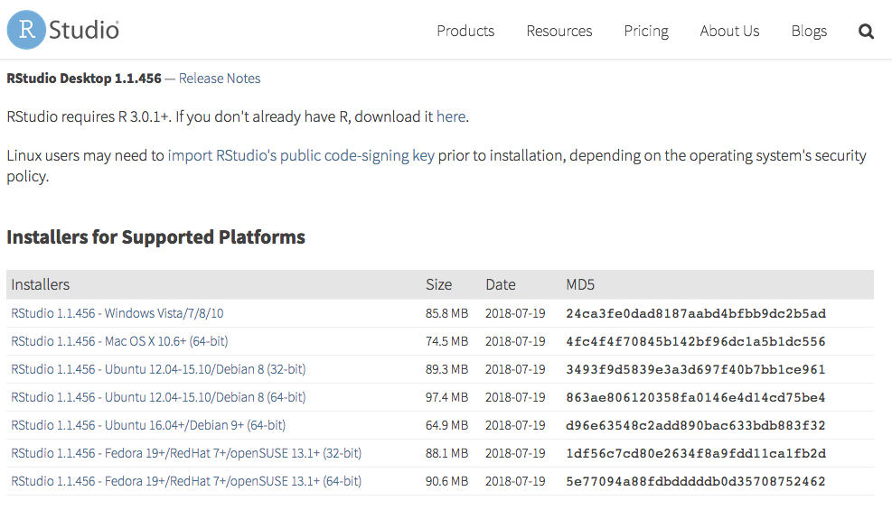
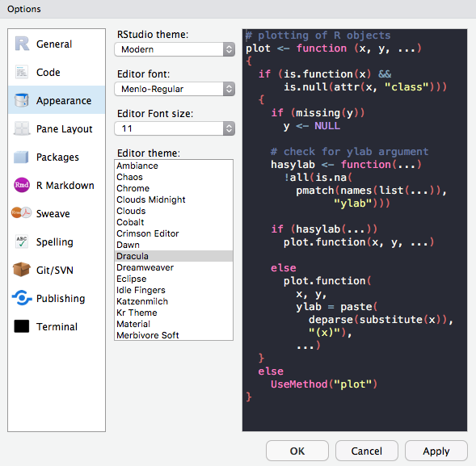
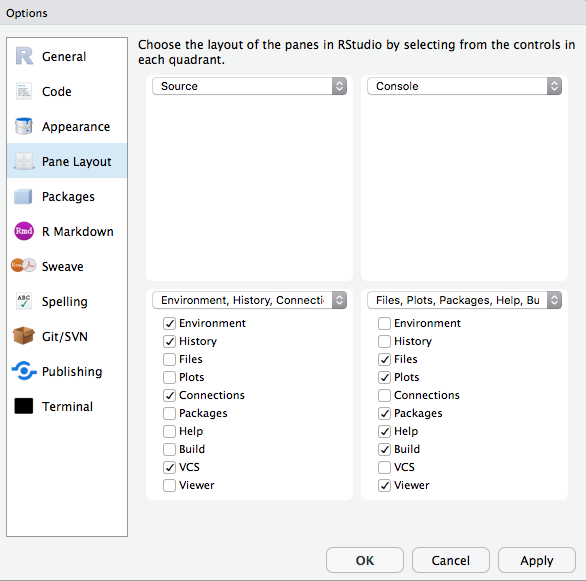
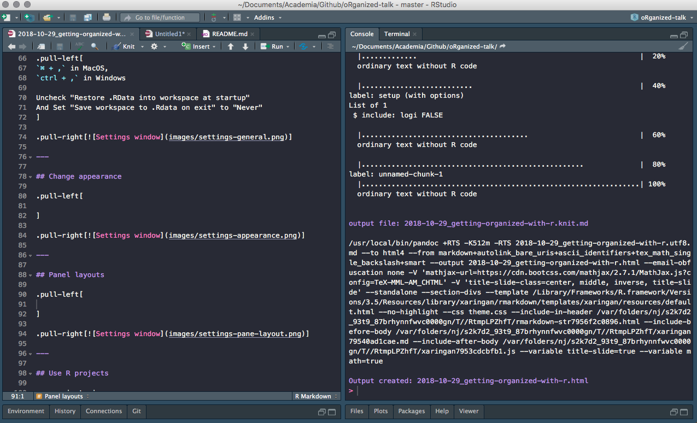
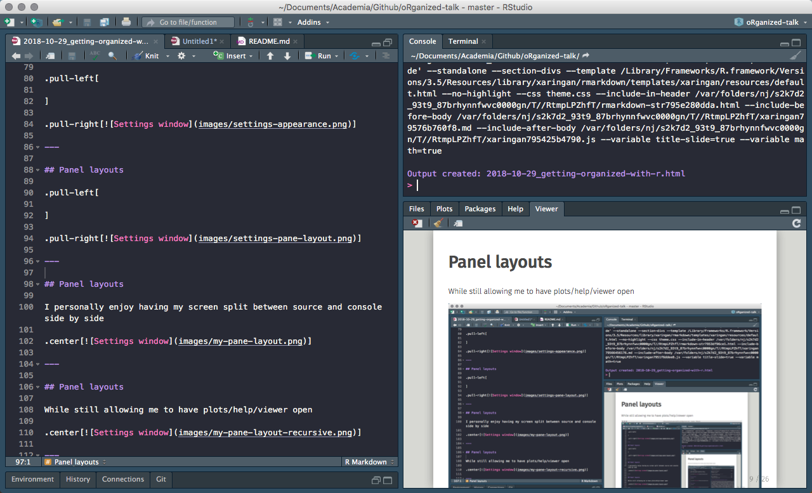
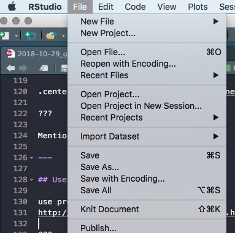
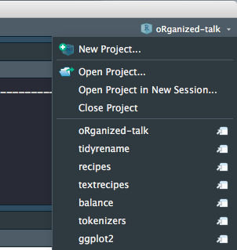
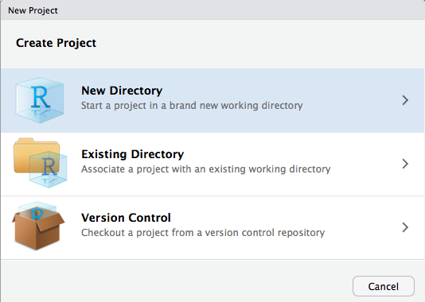
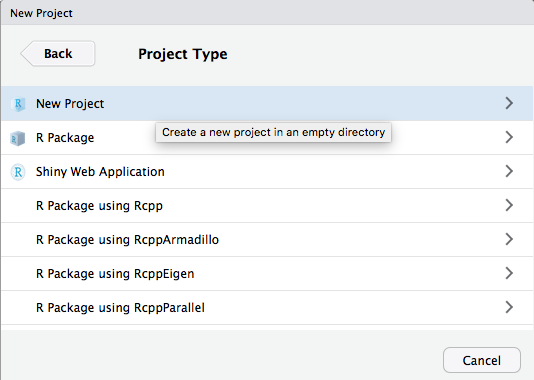
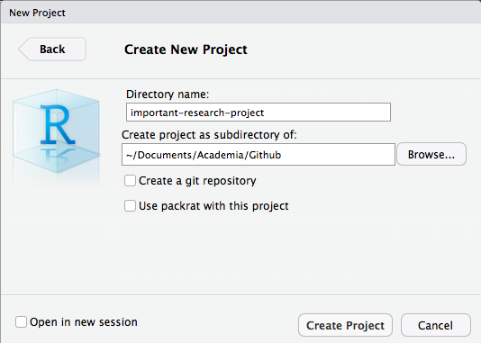

```{r setup, include=FALSE}
options(htmltools.dir.version = FALSE)
library(magrittr)
```

## Overview

--
- Before You Start Using R  

--
- Once You Start Writing R  

--

All references and additional information can be found in this repository

https://github.com/EmilHvitfeldt/oRganized-talk

---

class: center

# Before You Start Using R

---

## Use Rstudio

https://www.rstudio.com/products/rstudio/download/#download  

.center[]

???

Other alternatives. Emacs, Vim, Visual Studio.

---

## Change Settings

.pull-left[
.medium[**Keyboard shortcut to open settings**]  
`⌘ + ,` in Mac OS,  
`ctrl + ,` in Windows  

✓ - Uncheck "Restore .RData into work space at start up"  

✓ - Set "Save work space to .Rdata on exit" to "Never"
]

.pull-right[]

---

## Change Appearance

.pull-left[
Plenty choices of

- Rstudio themes
- Fonts
- Font Sizes
- Editor Themes

Play around! Find something you love!

]

.pull-right[]

---

## Pane layouts

.pull-left[
Change the layout of the panes  

Source on top?  
Source down to the right?  
Its all up to you!
]

.pull-right[]

---

## Pane layouts - My Setup

I like having both source and console open

.center[]

---

## Pane layouts - My Setup 2

... while still allowing me to have plots/help/viewer open

.center[]

???

Mention recursive viewer pane.

---

## RStudio Projects

Keep all files from one project together. Use RStudio projects.  

--
- Self contained

--
- Avoid overlapping

--
- Project orientated

???

keep all the files associated with a project together — input data, R scripts, analytic results, figures.

---

## RStudio Projects - Creation 1 / 4

Keep all files from one project together. Use RStudio projects.

.pull-left[
Click File > New Project  

]

.pull-right[
Or click on the upper right

]

---

## RStudio Projects - Creation 2 / 4

.center[]

---

## RStudio Projects - Creation 3 / 4

.center[]

---

## RStudio Projects - Creation 4 / 4

.center[]

---

## Folder Structure

--

```{r, eval=FALSE}
name_of_project
|--raw_data
    |--WhateverData.xlsx
    |--report_2017.csv
|--output_data
    |--summary2017.csv
|--rmd
    |--01-analysis.Rmd
|--docs
    |--01-analysis.html
    |--01-analysis.pdf
|--scripts
    |--exploratory_analysis.R
    |--pdf_scraper.R
|--figures
    |--weather_2017.png
|--name_of_project.Rproj
|--run_all.R
```

---

## Folder Structure

Everything has a spot where it belongs.

- Raw data separate from cleaned data
- Reports and scrips are separated
- Generated and imported figures has its own place
- Numbered using 2 digits
- Reusable and easily understandable

```{r, eval=FALSE}
library(fs)
folder_names <- c("raw_data", "output_data", "rmd", "docs", 
                  "scripts", "figures")

dir_create(fldr_names)
```

???

never modify raw data, only read (forever untouched)

---

## Paths

```{r, eval=FALSE}
library(tidyverse)

# data import
data <- read_csv("/Users/Emil/Research/Health/amazing_data.csv")
```

---

## Paths

```{r, error=TRUE, message=FALSE}
library(tidyverse)

# data import
data <- read_csv("/Users/Emil/Research/Health/amazing_data.csv")
```

--

__Only use relative paths, never absolute paths__

--

Introducing the *here* package.

```{r, eval=FALSE}
library(here)
here()
```
```{r echo=FALSE}
"/Users/Emil/Research/Health"
```

```{r, eval=FALSE}
library(here)
data <- read_csv(here("amazing_data.csv"))
```

---

## Naming Things

--

.center[]

???

- Organization
- Ease of use  
There will be multi slides about naming

---

## Naming Things - Files

### NO

```{r, eval=FALSE}
report.pdf
reportv2.pdf
reportthisisthelastone.pages
Figure 2.png 
3465-234szx.r
foo.R
```

### YES

```{r, eval=FALSE}
2018-10-01_01_report-for-cdc.pdf
01_data.rmd
01_data.pdf
02_data-filtering.rmd
02_data-filtering.pdf
```

???

Follow narrative from folder structure slide  
jenny Bryan naming things

---

## Naming Things - Files

We want file names to be "machine readable" and "human readable".

--

- Avoid spaces, punctuation, special characters and case sensitivity
- Deliberate use of delimiters
- File name should describe the **contents** of the file
- Put something numeric first
- Left pad numbers with zeroes
- Use ISO 8601 standard for dates (YYYY-MM-DD)

???

to preserve chronological and logical ordering.

---

## Naming Things - Files

```{r, eval=FALSE}
library(fs)
dir_ls("data/", regexp = "health-study")
```

```{r echo=FALSE}
(x <- glue::glue("2018-02-23_health-study_power-{rep(c(100, 200), each = 3)}_group-{rep(c('A', 'B', 'C'), 2)}1.csv"))
```

--

```{r}
stringr::str_split_fixed(x, "[_\\.]", 5)
```

???
- Avoid spaces, punctuation, special characters and case sensitivity  
- Deliberate use of delimiters  
- File name should describe the **contents** of the file  
- Put something numeric first  
- Left pad numbers with zeroes  
- Use ISO 8601 standard for dates (YYYY-MM-DD)

---

## Naming Things - Files

```{r, eval=FALSE}
library(fs)
dir_ls("data/", regexp = "health-study")
```

```{r echo=FALSE}
(x <- glue::glue("2018-02-23_health-study_power-{rep(c(100, 200), each = 3)}_group-{rep(c('A', 'B', 'C'), 2)}1.csv"))
```

--

```{r, eval=FALSE}
library(tidyverse)
map_df(dir_ls("data/", regexp = "health-study"), read_csv)

# or

dir_ls("data/", regexp = "health-study") %>%
  map_df(read_csv)
```

???
- Avoid spaces, punctuation, special characters and case sensitivity  
- Deliberate use of delimiters  
- File name should describe the **contents** of the file  
- Put something numeric first  
- Left pad numbers with zeroes  
- Use ISO 8601 standard for dates (YYYY-MM-DD)

---

## Naming Things - Objects

- Only use lowercase letters, numbers, and `_`
- Use names that are not jargony, **weight** instead of **K**
- Use informative names

--

```{r, eval=FALSE}
# Bad
df
e
tuningVar

# Good
health_data
error
tuning_var
```

???
lowercase letters + numbers = alpha-numeric characters (ish)

---

class: center

# Once You Start Writing R

---

## What To Avoid - attach()

Never use `attach()`

--

```{r, message=FALSE}
attach(mtcars)
mean(mpg)
```

Loading lots of names into the search path, ambiguous selections.

---

## What To Avoid - attach()

Never use `rm(list=ls())`

--

Will not reset packages, reset options, ...

Restart the R session  

CTRL+SHIFT+F10 for Windows  
CMD+SHIFT+ALT+F10 for Mac OS

---

## R Markdown

Most of your documents can be written in R Markdown.  

.center[]

Using the basics of markdown with the addition of R code chunks.

???
Reference Folder structure
web page, PDF, MS Word document, slide show, handout, book, dashboard, package vignette or other format.
rticles package

no more copy pasting results into your document.

---

## R Markdown

**R Markdown documents versus R scripts**

Use R scripts for simple self contained tasks.  

`source()` R scripts into your R Markdown document where you will do analyses, visualizations and reporting.

---

## R Markdown

```{r, eval=FALSE}
- 01-import.R
- 02-clean-names.R
- 03-tidy.R
- etc
```

--

Include at the start of R Markdown file

```{r, eval=FALSE}
{r load_scripts, include = FALSE}
library(here)
source(here("scripts", "01-import.R"))
source(here("scripts", "02-clean-names.R"))
source(here("scripts", "03-tidy.R"))
```

???

---

## Naming Chunks

Names can be placed after the comma

````markdown
`r ''````{r, chunk-label, results='hide', fig.height=4}
````

or before

````markdown
`r ''````{r chunk-label, results='hide', fig.height=4}
````

> In general it is recommended to use alphabetic characters with words separated by - and avoid other characters. - Yihui Xie

---

## Naming Chunks

- Make navigating the R Markdown document easier
- Make your R Markdown easier to understand
- Clarifies error reports or progress of knitting
- Caching when moving chunks around
- Feels good

???

Lower left corner of Rstudio have menu where sections and chunks can be selected with.

Caching on unnamed chunks are based on numbering.

---

## Setup Chunk

In a fresh R Markdown document you see this

````markdown
`r ''````{r setup, include=FALSE}
knitr::opts_chunk$set(echo = TRUE)
````
--

The setup chuck is run before another code - use to your advantage

---

## Chunk Options

> Defaults will rarely work for you 100% of the time.

--

Set `echo = TRUE`, knit document with code.  
Set `echo = FALSE`, reknit document with the code hidden.

--

.small[
- eval
- echo
- results
- collapse
- fig.path
- warning
- error
- message
]

???
Working with colleagues that knows R
Working with colleagues that don't

---

## Chunk Options

--

````markdown
`r ''````{r setup, include=FALSE}
knitr::opts_chunk$set(fig.path = "figures/")
````

Will save all figures in the the folder figures with the chunk name.

???
highlight use of fig.path option

fig.path: ('figure/'; character) prefix to be used for figure filenames (fig.path and chunk labels are concatenated to make filenames)

---

## Styling Code

Use consistent style when writing code  

--

[http://style.tidyverse.org/](http://style.tidyverse.org/)

--

All about preferences but keep it consistent!!!

???

Give examples of styles to follow

---

## Keep .Rprofile Clean

Your project contains a file called .Rprofile.

This file runs first in every session. Think of it as configuration file.

--

```{r, eval=FALSE}
options(stringsAsFactors = FALSE)
options(max.print = 100)
```

--

_PANIC!!!_ Code will only work for you!  
Avoid putting output altering code in .Rprofile!

???

Use it to change options and load packages

---

## Comment Your Code

- Functions: Arguments and purpose
- Code: What or why, NOT how

--

```{r, eval=FALSE}
# Takes a data.frame (data) and replaces the columns with the names
# (names) and converts them from factor variable to character 
# variables. Keeps characters variables unchanged.
factor_to_text <- function(data, names) {
  for (i in seq_along(names)) {
    if(is.factor(data[, names[i], drop = TRUE]))
      data[, names[i]] <- as.character.factor(data[, names[i], 
                                                   drop = TRUE])
  }
  data
}
```


---

## Should You Write a Function?

> Once you’ve written the same code 3 times, write a function

```{r, eval=FALSE}
mtcars %>% 
  mutate(mpg = mpg / 2.5 + 2,
         cyl = cyl / 2.5 + 2,
         hp = hp / 2.5 + 2)
```

--

You should have added 3 instead of 2

```{r, eval=FALSE}
mtcars %>% 
  mutate(mpg = mpg / 2.5 + 2,
         cyl = cyl / 2.5 + 3,
         hp = hp / 2.5 + 3)
```

---

## Should You Write a Function?

> Once you’ve written the same code 3 times, write a function

--

```{r, eval=FALSE}
scale_fun <- function(x) x / 2.5 + 3

mtcars %>% 
  mutate(mpg = scale_fun(mpg),
         cyl = scale_fun(cyl),
         hp = scale_fun(hp))
```

---

## Testing

Use tests in your pipeline to check assumptions.

```{r, eval=FALSE}
library(tidyverse)

data <- fancy_gov_data_api("health", year = 2018, month = 10)

data %>% 
  group_by(county) %>% 
  summarize(happiness = (- death + love) / population)
```

???

Say you are downloading data from government API.

---

## Testing

__testhat__ is primarily used for unit testing in R packages.

Contains large collection of `expect_` functions.

- expect_equal
- expect_equivalent
- expect_error
- expect_length
- expect_named
- ...

---

## Testing


Use tests in your pipeline to check assumptions.

```{r, eval=FALSE}
library(tidyverse)
library(testthat)

data <- fancy_gov_data_api("health", year = 2018, month = 10)

expect_length(unique(data$county), 3007)
expect_gt(mean(data$love == NA), 0.1)

data %>% 
  group_by(county) %>% 
  summarize(happiness = (- death + love) / population)
```

???

Say you are downloading data from government API.
