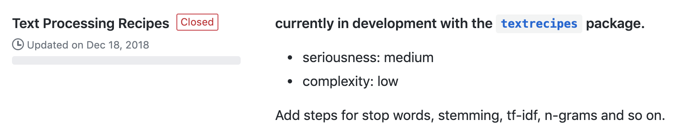
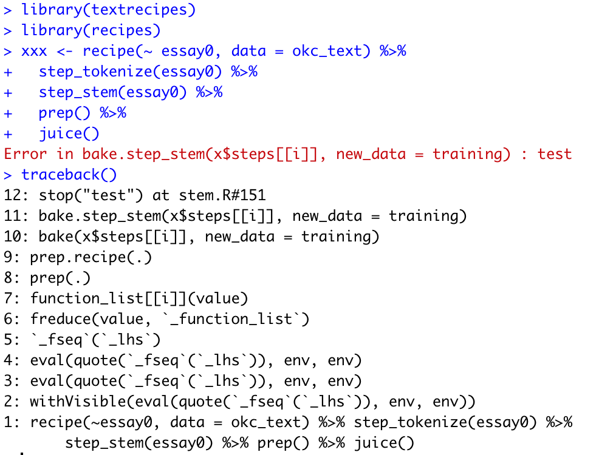

```{r include=FALSE}
library(knitr)
hook_output <- knit_hooks$get("output")
knit_hooks$set(output = function(x, options) {
  lines <- options$output.lines
  if (is.null(lines)) {
    return(hook_output(x, options))  # pass to default hook
  }
  x <- unlist(strsplit(x, "\n"))
  more <- "..."
  if (length(lines) == 1) {        # first n lines
    if (length(x) > lines) {
      # truncate the output, but add ....
      x <- c(head(x, lines), more)
    }
  } else {
    x <- c(more, x[lines], more)
  }
  # paste these lines together
  x <- paste(c(x, ""), collapse = "\n")
  hook_output(x, options)
})
knit_hooks$set(output = function(x, options) {
  # this hook is used only when the linewidth option is not NULL
  if (!is.null(n <- options$linewidth)) {
    x = knitr:::split_lines(x)
    # any lines wider than n should be wrapped
    if (any(nchar(x) > n)) x = strwrap(x, width = n)
    x = paste(x, collapse = '\n')
  }
  hook_output(x, options)
})

opts_chunk$set(
  echo = TRUE,
  fig.width = 7, 
  fig.align = 'center',
  fig.asp = 0.618, # 1 / phi
  out.width = "700px")
```

class: listfillpage
# Overview

.listfill[
- Open Source Software Development
- My journey
- What I learned
]

This talk is based on anecdotes, I dearly hope that they generalize!

---

# As a new developer it can be hard to find problems that are:

- Easy enough for you do
- Prominent enough that they are worth solving

## My advice

- Keep list of ideas
- Google early and often about implementations

Working on a implentation can still be fruitful even if it doesn't end up on CRAN.

---

.center[

]

---

.center[

]

---

# Look for Github tags


---


---

# Ask before starting the work

Makes sure that:

- you are not doing the same work as someone else
- the work is wanted

---

.center[

]

Artwork by @allison_horst

---

# Github Projects

.center[

]

---

.center[

]

---


---
class: no-padding


---

# Challenges

- inherent messy structure of text
- steps don't have specified order

--

# Design choice

## Flexibility > Speed

---


---

```{css, echo=FALSE}
.code40 {
  font-size: 40%;
}
```

.pull-left[
.code40[
```{r, eval=FALSE}
step_stem <-
  function(recipe,
           ...,
           role = NA,
           trained = FALSE,
           columns = NULL,
           options = list(),
           custom_stemmer = NULL,
           skip = FALSE,
           id = rand_id("stem")
  ) {
    add_step(
      recipe,
      step_stem_new(
        terms = ellipse_check(...),
        role = role,
        trained = trained,
        options = options,
        custom_stemmer = custom_stemmer,
        columns = columns,
        skip = skip,
        id = id
      )
    )
  }

step_stem_new <-
  function(terms, role, trained, columns, options, custom_stemmer, skip, id) {
    step(
      subclass = "stem",
      terms = terms,
      role = role,
      trained = trained,
      columns = columns,
      options = options,
      custom_stemmer = custom_stemmer,
      skip = skip,
      id = id
    )
  }

prep.step_stem <- function(x, training, info = NULL, ...) {
  col_names <- terms_select(x$terms, info = info)

  check_list(training[, col_names])

  step_stem_new(
    terms = x$terms,
    role = x$role,
    trained = TRUE,
    columns = col_names,
    options = x$options,
    custom_stemmer = x$custom_stemmer,
    skip = x$skip,
    id = x$id
  )
}
```
]
]

.pull-right[
.code40[
```{r, eval=FALSE}


bake.step_stem <- function(object, new_data, ...) {
  col_names <- object$columns

  stem_fun <- object$custom_stemmer %||%
    SnowballC::wordStem

  for (i in seq_along(col_names)) {
    stemmed_text <- map(new_data[, col_names[i], drop = TRUE],
                        stem_fun)

    new_data[, col_names[i]] <- tibble(stemmed_text)
  }
  new_data <- factor_to_text(new_data, col_names)
  as_tibble(new_data)
}

print.step_stem <-
  function(x, width = max(20, options()$width - 30), ...) {
    cat("Stemming for ", sep = "")
    printer(x$columns, x$terms, x$trained, width = width)
    invisible(x)
}

tidy.step_stem <- function(x, ...) {
  if (is_trained(x)) {
    res <- tibble(terms = x$terms,
                  is_custom_stemmer = is.null(x$custom_stemmer))
  } else {
    term_names <- sel2char(x$terms)
    res <- tibble(terms = term_names,
                  value = na_chr)
  }
  res$id <- x$id
  res
}
```
]
]

---

```{css, echo=FALSE}
.code40 {
  font-size: 40%;
}
```

.pull-left[
.code40[
```{r, eval=FALSE}
step_stem <-
  function(recipe,
           ...,
           role = NA,
           trained = FALSE,
           columns = NULL,
           options = list(),
           custom_stemmer = NULL,
           skip = FALSE,
           id = rand_id("stem")
  ) {
    add_step(
      recipe,
      step_stem_new(
        terms = ellipse_check(...),
        role = role,
        trained = trained,
        options = options,
        custom_stemmer = custom_stemmer,
        columns = columns,
        skip = skip,
        id = id
      )
    )
  }

step_stem_new <-
  function(terms, role, trained, columns, options, custom_stemmer, skip, id) {
    step(
      subclass = "stem",
      terms = terms,
      role = role,
      trained = trained,
      columns = columns,
      options = options,
      custom_stemmer = custom_stemmer,
      skip = skip,
      id = id
    )
  }

prep.step_stem <- function(x, training, info = NULL, ...) {
  col_names <- terms_select(x$terms, info = info)

  check_list(training[, col_names])

  step_stem_new(
    terms = x$terms,
    role = x$role,
    trained = TRUE,
    columns = col_names,
    options = x$options,
    custom_stemmer = x$custom_stemmer,
    skip = x$skip,
    id = x$id
  )
}
```
]
]

.pull-right[
.code40[
```{r, eval=FALSE}
bake.step_stem <- function(object, new_data, ...) {
  col_names <- object$columns #<<
                              #<<
  stem_fun <- object$custom_stemmer %||% #<<
    SnowballC::wordStem #<<
                         #<<
  for (i in seq_along(col_names)) { #<<
    stemmed_text <- map(new_data[, col_names[i], drop = TRUE], #<<
                        stem_fun) #<<
                         #<<
    new_data[, col_names[i]] <- tibble(stemmed_text) #<<
  } #<<
  new_data <- factor_to_text(new_data, col_names) #<<
  as_tibble(new_data) #<<
}

print.step_stem <-
  function(x, width = max(20, options()$width - 30), ...) {
    cat("Stemming for ", sep = "")
    printer(x$columns, x$terms, x$trained, width = width)
    invisible(x)
}

tidy.step_stem <- function(x, ...) {
  if (is_trained(x)) {
    res <- tibble(terms = x$terms,
                  is_custom_stemmer = is.null(x$custom_stemmer))
  } else {
    term_names <- sel2char(x$terms)
    res <- tibble(terms = term_names,
                  value = na_chr)
  }
  res$id <- x$id
  res
}
```
]
]

---

# The bake step

```{r}
bake.step_stem <- function(object, new_data, ...) {
  col_names <- object$columns 
                          
  stem_fun <- object$custom_stemmer %||% 
    SnowballC::wordStem 
                         
  for (i in seq_along(col_names)) { 
    stemmed_text <- map(new_data[, col_names[i], drop = TRUE], 
                        stem_fun) 
                         
    new_data[, col_names[i]] <- tibble(stemmed_text) 
  } 
  new_data <- factor_to_text(new_data, col_names) 
  as_tibble(new_data) 
}
```

---

# the traceback

.pull-left[

]

.pull-right[
- I call `prep()`
- `prep()` calls `prep.recipe()`
- `prep.recipe()` calls `bake()` in a loop
- `bake()` calls `bake.step_stem()`

quite a few levels deep.
]

---

# Browser to the rescue


---

# Plenty of follow up


---

# Don't reinvent the wheel

textrecipes stands on the shoulders of

- recipe (obviously)
- tokenizers
- SnowballC
- stopwords
- text2vec
- textfeatures

---

# My biggest git mistake


---

# The reward - joined my first organization


---

# The reward - CRAN releases


---

# The reward - Post on tidyverse.org


---

class: center, middle

# Thank you!

### `r icon::fa("github")` [EmilHvitfeldt](https://github.com/EmilHvitfeldt/)
### `r icon::fa("twitter")` [@Emil_Hvitfeldt](https://twitter.com/Emil_Hvitfeldt)
### `r icon::fa("linkedin")` [emilhvitfeldt](linkedin.com/in/emilhvitfeldt/)
### `r icon::fa("laptop")` [www.hvitfeldt.me](www.hvitfeldt.me)


Slides created via the R package [xaringan](https://github.com/yihui/xaringan).
