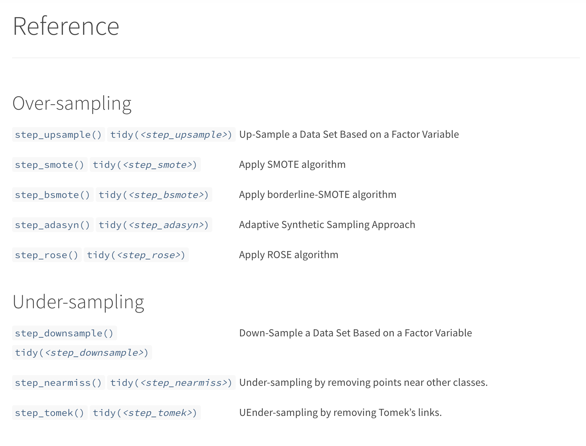
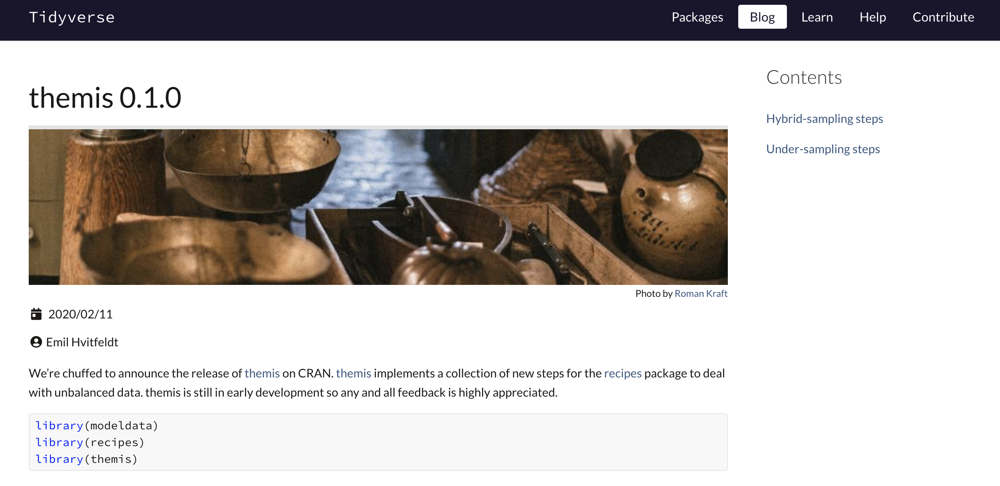

```{r include=FALSE}
library(knitr)
hook_output <- knit_hooks$get("output")
knit_hooks$set(output = function(x, options) {
   lines <- options$output.lines
   if (is.null(lines)) {
     return(hook_output(x, options))  # pass to default hook
   }
   x <- unlist(strsplit(x, "\n"))
   more <- "..."
   if (length(lines)==1) {        # first n lines
     if (length(x) > lines) {
       # truncate the output, but add ....
       x <- c(head(x, lines), more)
     }
   } else {
     x <- c(more, x[lines], more)
   }
   # paste these lines together
   x <- paste(c(x, ""), collapse = "\n")
   hook_output(x, options)
 })

opts_chunk$set(
  echo = TRUE,
  fig.width = 7, 
  fig.align = 'center',
  fig.asp = 0.618, # 1 / phi
  dpi = 320,
  out.width = "700px")
```

```{r, echo = FALSE, message=FALSE}
library(sass)
library(magrittr)
library(flair)
library(recipes)
library(tidyverse)
library(ggtext)
sass(sass_file("theme.sass"), output = "theme.css")
```

```{r, echo=FALSE}
orange <- "#EF8633"
blue <- "#006766"

sass(list(
  list(orange = orange,
       blue = blue),
  "
  .orange {color: $orange}
  .blue {color: $blue}
  "
))

data <- palmerpenguins::penguins %>%
  transmute(var1 = scale(bill_length_mm),
            var2 = scale(flipper_length_mm),
            class = factor(species == "Adelie", labels = c("Low Risk", "At Risk"))) %>%
  drop_na() %>%
  filter(!(class == "At Risk" & row_number() %% 2 == 0))

data_colors <- rev(c("#B2EAEB", "#D7FF85"))
data_dark <- rev(c("#006766", "#4B8000"))
```

## Motivated Fictional Scenario

You work at a healthcare startup

The company's mission is to provide preventive care to lower overall medical costs

A cancer screening is available and you have been tasked to develop a model that classifies customers that would benefit from it

---

## Modeling with tidymodels

```{r, eval=FALSE}
customers_data <- read_csv("data/customers.csv")
```

--

```{r, eval=FALSE}
library(tidymodels)
```

---

## Modeling with tidymodels

```{r, eval=FALSE}
customers_data <- read_csv("data/customers.csv")
```

```{r, eval=FALSE}
library(tidymodels)

[...]
# Use company modeling template
[...]
```

---

## Modeling with tidymodels

```{r, eval=FALSE}
customers_data <- read_csv("data/customers.csv")
```

```{r, eval=FALSE}
library(tidymodels)

[...]
# Use company modeling template
[...]

model_results %>%
  collect_metrics()

## # A tibble: 1 x 5
##   .metric  .estimator  mean     n std_err
##   <chr>    <chr>      <dbl> <int>   <dbl>
## 1 accuracy binary     0.938    10 0.00570
```

---

# Confusion Matrix

--

```{r, echo=FALSE}
imdata1 <- tibble(class = factor(rep(c("At Risk", "Low Risk"), c(2352, 35870))))

model_results <- imdata1 %>%
  mutate(.pred = factor("Low Risk", levels = c("At Risk", "Low Risk")))
```

```{r, echo=FALSE}
model_results %>%
  yardstick::conf_mat(class, .pred) %>%
  autoplot(type = "heatmap")
```

---

# Class distribution

```{r echo=FALSE, message=FALSE}
library(tidyverse)

imdata1 %>%
  ggplot(aes(class, fill = class)) +
  geom_bar() +
  theme_minimal() +
  scale_fill_manual(values = rev(data_colors)) +
  guides(fill = "none")
```

---


---


---

# How to deal with unbalanced data

---

# How to deal with unbalanced data

  - Use weights

---

# How to deal with unbalanced data

  - Use weights
  - Ensemble Methods
  
---

# How to deal with unbalanced data

  - Use weights
  - Ensemble Methods
  - Over-sampling

---

# How to deal with unbalanced data

  - Use weights
  - Ensemble Methods
  - Over-sampling
  - Under-sampling

---

# How to deal with unbalanced data

  - Use weights
  - Ensemble Methods
  - **Over-sampling**
  - **Under-sampling**

---

# Definitions

### Over-sampling

Creating additional oberservations for minority classes

### Under-sampling

Remove observations from majority classes

---

# Disclaimer

All visualizations are done in two dimensions

But methods generalize to higher dimensions

Similarly most examples will only have two classes

---

.hidden[
## Title
]

```{r, echo=FALSE, out.width='100%', fig.align='center', fig.asp = 0.45}
data %>%
  ggplot(aes(var1, var2, color = class, fill = class)) +
  geom_point(shape = 21) +
  theme_minimal() +
  scale_color_manual(values = data_dark, guide = guide_legend(reverse = TRUE)) +
  scale_fill_manual(values = data_colors, guide = guide_legend(reverse = TRUE)) +
  theme(axis.text.x = element_blank(),
        axis.text.y = element_blank()) +
  labs(x = NULL, y = NULL, color = NULL, fill = NULL) +
  guides(fill = "none", color = "none") +
  lims(x = range(data$var1), y = range(data$var2))
```

---

## Randomly remove samples from majority

```{r, echo=FALSE, out.width='100%', fig.align='center', fig.asp = 0.45}
data %>%
  ggplot(aes(var1, var2, color = class, fill = class)) +
  geom_point(shape = 21) +
  theme_minimal() +
  scale_color_manual(values = data_dark, guide = guide_legend(reverse = TRUE)) +
  scale_fill_manual(values = data_colors, guide = guide_legend(reverse = TRUE)) +
  theme(axis.text.x = element_blank(),
        axis.text.y = element_blank()) +
  labs(x = NULL, y = NULL, color = NULL, fill = NULL) +
  guides(fill = "none", color = "none") +
  lims(x = range(data$var1), y = range(data$var2))
```

---

## Randomly remove samples from majority

```{r, echo = FALSE}
dowm_sample_data <- data %>%
  sample_frac() %>%
  group_by(class) %>%
  mutate(remove =!(class == "Low Risk" & row_number() >= 77)) %>%
  ungroup()
```

```{r, echo=FALSE, out.width='100%', fig.align='center', fig.asp = 0.45}
dowm_sample_data %>%
  filter(remove) %>%
  ggplot(aes(var1, var2, color = class, fill = class)) +
  geom_point(shape = 21) +
  geom_point(data = filter(dowm_sample_data, !remove), color = data_dark[1]) +
  theme_minimal() +
  scale_color_manual(values = data_dark, guide = guide_legend(reverse = TRUE)) +
  scale_fill_manual(values = data_colors, guide = guide_legend(reverse = TRUE)) +
  theme(axis.text.x = element_blank(),
        axis.text.y = element_blank()) +
  labs(x = NULL, y = NULL, color = NULL, fill = NULL) +
  guides(fill = "none", color = "none") +
  lims(x = range(data$var1), y = range(data$var2))
```

---

## Randomly remove samples from majority

```{r, echo=FALSE, out.width='100%', fig.align='center', fig.asp = 0.45}
dowm_sample_data %>%
  filter(remove) %>%
  ggplot(aes(var1, var2, color = class, fill = class)) +
  geom_point(shape = 21) +
  theme_minimal() +
  scale_color_manual(values = data_dark, guide = guide_legend(reverse = TRUE)) +
  scale_fill_manual(values = data_colors, guide = guide_legend(reverse = TRUE)) +
  theme(axis.text.x = element_blank(),
        axis.text.y = element_blank()) +
  labs(x = NULL, y = NULL, color = NULL, fill = NULL) +
  guides(fill = "none", color = "none") +
  lims(x = range(data$var1), y = range(data$var2))
```

---

# Over-sampling

We want to create additional points

But how should they be created?

---

# Over-sampling

We want to create additional points

But how should they be created?

- Duplicates of existing points

---

# Over-sampling

We want to create additional points

But how should they be created?

- Duplicates of existing points
- Generate points around existing points

---

# Over-sampling

We want to create additional points

But how should they be created?

- Duplicates of existing points
- Generate points around existing points
- Create a generative model and sample points

---

# Over-sampling

We want to create additional points

But how should they be created?

- Duplicates of existing points
- **Generate points around existing points**
- Create a generative model and sample points

---

# SMOTE

--

- **S**ynthetic 
- **M**inority 
- **O**ver-sampling 
- **TE**chnique

--

SMOTE is a cleaver technique which works by generating between existing points

---

.pull-left[

]

.pull-right[
```{r, echo=FALSE, out.width='100%', fig.align='center', fig.asp = 0.9}
data %>%
  ggplot(aes(var1, var2, color = class, fill = class)) +
  geom_point(shape = 21) +
  theme_minimal() +
  scale_color_manual(values = data_dark, guide = guide_legend(reverse = TRUE)) +
  scale_fill_manual(values = data_colors, guide = guide_legend(reverse = TRUE)) +
  theme(axis.text.x = element_blank(),
        axis.text.y = element_blank()) +
  labs(x = NULL, y = NULL, color = NULL, fill = NULL) +
  guides(fill = "none", color = "none") +
  lims(x = range(data$var1), y = range(data$var2))
```
]

---

.pull-left[

]

.pull-right[
```{r, echo=FALSE, out.width='100%', fig.align='center', fig.asp = 0.9}
data %>%
  ggplot(aes(var1, var2, color = class, fill = class)) +
  geom_point(shape = 21) +
  theme_minimal() +
  scale_color_manual(values = data_dark, guide = guide_legend(reverse = TRUE)) +
  scale_fill_manual(values = data_colors, guide = guide_legend(reverse = TRUE)) +
  theme(axis.text.x = element_blank(),
        axis.text.y = element_blank()) +
  labs(x = NULL, y = NULL, color = NULL, fill = NULL) +
  guides(fill = "none", color = "none") +
  lims(x = range(data$var1), y = range(data$var2)) +
  annotate("rect", xmin = -0.7, xmax = -0.15, ymin = -0.7, ymax = -0.15,
  alpha = .2)
```
]

---

.pull-left[
**To SMOTE a point**
]

.pull-right[
```{r, echo=FALSE, out.width='100%', fig.align='center', fig.asp = 0.9}
data %>%
  ggplot(aes(var1, var2, color = class, fill = class)) +
  geom_point(shape = 21, size = 6) +
  theme_minimal() +
  scale_color_manual(values = data_dark, guide = guide_legend(reverse = TRUE)) +
  scale_fill_manual(values = data_colors, guide = guide_legend(reverse = TRUE)) +
  theme(axis.text.x = element_blank(),
        axis.text.y = element_blank()) +
  labs(x = NULL, y = NULL, color = NULL, fill = NULL) +
  guides(fill = "none", color = "none") +
  coord_cartesian(xlim = c(-0.7, -0.15), ylim = c(-0.7, -0.15))
```
]

---

.pull-left[
**To SMOTE a point**

1. Select a **.blue[point]**
]

.pull-right[
```{r, echo=FALSE, out.width='100%', fig.align='center', fig.asp = 0.9}
id_val <- 57

data %>%
  ggplot(aes(var1, var2, color = class, fill = class)) +
  geom_point(shape = 21, size = 6) +
  theme_minimal() +
  scale_color_manual(values = data_dark, guide = guide_legend(reverse = TRUE)) +
  scale_fill_manual(values = data_colors, guide = guide_legend(reverse = TRUE)) +
  theme(axis.text.x = element_blank(),
        axis.text.y = element_blank()) +
  labs(x = NULL, y = NULL, color = NULL, fill = NULL) +
  guides(fill = "none", color = "none") +
  coord_cartesian(xlim = c(-0.7, -0.15), ylim = c(-0.7, -0.15)) +
  geom_point(data = mutate(data, id = row_number()) %>% filter(id == id_val),
             size = 8)
```
]

---

.pull-left[
**To SMOTE a point**

1. Select a point
1. Find n **nearest neighbors** inside the same class (n = 5)
]

.pull-right[
```{r, echo=FALSE, out.width='100%', fig.align='center', fig.asp = 0.9}
id_val <- 57

lines_5 <- inner_join(suffix = c("_from", "_to"), by = c("id"),
data %>% mutate(id = row_number()) %>% filter(id == id_val) %>% select(-class),
data %>%
  slice(RANN::nn2(data[, 1:2], k = 6)$nn.idx[id_val, -1]) %>%
  mutate(id = id_val),
)

data %>%
  ggplot(aes(var1, var2, color = class, fill = class)) +
  geom_segment(aes(var1_from, var2_from, xend = var1_to, yend = var2_to), 
               data = lines_5, color = "grey30", linetype = "dashed", 
               inherit.aes = FALSE) +
  geom_point(shape = 21, size = 6) +
  theme_minimal() +
  scale_color_manual(values = data_dark, guide = guide_legend(reverse = TRUE)) +
  scale_fill_manual(values = data_colors, guide = guide_legend(reverse = TRUE)) +
  theme(axis.text.x = element_blank(),
        axis.text.y = element_blank()) +
  labs(x = NULL, y = NULL, color = NULL, fill = NULL) +
  guides(fill = "none", color = "none") +
  coord_cartesian(xlim = c(-0.7, -0.15), ylim = c(-0.7, -0.15)) +
  geom_point(data = mutate(data, id = row_number()) %>% filter(id == id_val),
             size = 8) 
```
]
---

.pull-left[
**To SMOTE a point**

1. Select a point
1. Find n nearest neighbors inside the same class (n = 5)
1. Randomly pick 1 **neighbors**
]

.pull-right[
```{r, echo=FALSE, out.width='100%', fig.align='center', fig.asp = 0.9}
id_val <- 57

lines_5 <- inner_join(suffix = c("_from", "_to"), by = c("id"),
data %>% mutate(id = row_number()) %>% filter(id == id_val) %>% select(-class),
data %>%
  slice(RANN::nn2(data[, 1:2], k = 6)$nn.idx[id_val, -1]) %>%
  mutate(id = id_val),
)

data %>%
  ggplot(aes(var1, var2, color = class, fill = class)) +
  geom_segment(aes(var1_from, var2_from, xend = var1_to, yend = var2_to), 
               data = lines_5, color = "grey30", linetype = "dashed", 
               inherit.aes = FALSE) +
  geom_segment(aes(var1_from, var2_from, xend = var1_to, yend = var2_to), 
               data = lines_5[4, ], color = "black", size = 2,
               inherit.aes = FALSE) +
  geom_point(shape = 21, size = 6) +
  theme_minimal() +
  scale_color_manual(values = data_dark, guide = guide_legend(reverse = TRUE)) +
  scale_fill_manual(values = data_colors, guide = guide_legend(reverse = TRUE)) +
  theme(axis.text.x = element_blank(),
        axis.text.y = element_blank()) +
  labs(x = NULL, y = NULL, color = NULL, fill = NULL) +
  guides(fill = "none", color = "none") +
  coord_cartesian(xlim = c(-0.7, -0.15), ylim = c(-0.7, -0.15))
```
]

---

.pull-left[
**To SMOTE a point**

1. Select a point
1. Find n nearest neighbors inside the same class (n = 5)
1. Randomly pick 1 neighbors
1. Generate 1 **.blue[point]** randomly along the line
]

.pull-right[
```{r, echo=FALSE, out.width='100%', fig.align='center', fig.asp = 0.9}
id_val <- 57

lines_5 <- inner_join(suffix = c("_from", "_to"), by = c("id"),
data %>% mutate(id = row_number()) %>% filter(id == id_val) %>% select(-class),
data %>%
  slice(RANN::nn2(data[, 1:2], k = 6)$nn.idx[id_val, -1]) %>%
  mutate(id = id_val),
)


rand_val <- 0.4
new_point <- lines_5[4, ] %>%
  mutate(var1 = var1_to + (var1_from - var1_to) * rand_val,
         var2 = var2_to + (var2_from - var2_to) * rand_val)


data %>%
  ggplot(aes(var1, var2, color = class, fill = class)) +
  geom_segment(aes(var1_from, var2_from, xend = var1_to, yend = var2_to), 
               data = lines_5, color = "grey30", linetype = "dashed", 
               inherit.aes = FALSE) +
  geom_segment(aes(var1_from, var2_from, xend = var1_to, yend = var2_to), 
               data = lines_5[4, ], color = "black", size = 2,
               inherit.aes = FALSE) +
  geom_point(shape = 21, size = 6) +
  theme_minimal() +
  scale_color_manual(values = data_dark, guide = guide_legend(reverse = TRUE)) +
  scale_fill_manual(values = data_colors, guide = guide_legend(reverse = TRUE)) +
  theme(axis.text.x = element_blank(),
        axis.text.y = element_blank()) +
  labs(x = NULL, y = NULL, color = NULL, fill = NULL) +
  guides(fill = "none", color = "none") +
  coord_cartesian(xlim = c(-0.7, -0.15), ylim = c(-0.7, -0.15)) +
  geom_point(data = new_point, size = 8)
```
]

---

.pull-left[
**To SMOTE a point**

1. Select a point
1. Find n nearest neighbors inside the same class (n = 5)
1. Randomly pick 1 neighbors
1. Generate 1 **.blue[point]** randomly along the line
]

.pull-right[
```{r, echo=FALSE, out.width='100%', fig.align='center', fig.asp = 0.9}
id_val <- 57

lines_5 <- inner_join(suffix = c("_from", "_to"), by = c("id"),
data %>% mutate(id = row_number()) %>% filter(id == id_val) %>% select(-class),
data %>%
  slice(RANN::nn2(data[, 1:2], k = 6)$nn.idx[id_val, -1]) %>%
  mutate(id = id_val),
)


rand_val <- 0.4
new_point <- lines_5[4, ] %>%
  mutate(var1 = var1_to + (var1_from - var1_to) * rand_val,
         var2 = var2_to + (var2_from - var2_to) * rand_val)


data %>%
  ggplot(aes(var1, var2, color = class, fill = class)) +
  geom_point(shape = 21, size = 6) +
  theme_minimal() +
  scale_color_manual(values = data_dark, guide = guide_legend(reverse = TRUE)) +
  scale_fill_manual(values = data_colors, guide = guide_legend(reverse = TRUE)) +
  theme(axis.text.x = element_blank(),
        axis.text.y = element_blank()) +
  labs(x = NULL, y = NULL, color = NULL, fill = NULL) +
  guides(fill = "none", color = "none") +
  coord_cartesian(xlim = c(-0.7, -0.15), ylim = c(-0.7, -0.15)) +
  geom_point(data = new_point, size = 8)
```
]

---

.pull-left[

# SMOTE

If we want to create balance in between classes we simply generate majority_count - minority_count points
]

.pull-right[
```{r, echo=FALSE, out.width='100%', fig.align='center', fig.asp = 0.9}
set.seed(1234)
library(themis)
tb <- sort(table(data$class, useNA = "always"))

ds_res_indicator <- recipe(class ~ var1 + var2, data = data) %>%
  step_smote(class) %>%
  prep() %>%
  juice() %>%
  group_by(class) %>%
  mutate(artificial = row_number() <= tb[as.character(class)]) %>%
  ungroup() %>%
  filter(!artificial)


data %>%
  ggplot(aes(var1, var2, color = class, fill = class)) +
  geom_point(shape = 21) +
  theme_minimal() +
  scale_color_manual(values = data_dark, guide = guide_legend(reverse = TRUE)) +
  scale_fill_manual(values = data_colors, guide = guide_legend(reverse = TRUE)) +
  theme(axis.text.x = element_blank(),
        axis.text.y = element_blank()) +
  labs(x = NULL, y = NULL, color = NULL, fill = NULL) +
  guides(fill = "none", color = "none") +
  lims(x = range(data$var1), y = range(data$var2)) +
  geom_point(data = ds_res_indicator)
```
]


---

.pull-left[

# Borderline SMOTE

Points with with only its own class as neighbor are "safe".
Points with with only other classes as neighbor are "lost".
If more then half of the neighbors comes from a different class it is labeled "danger".
]

.pull-right[
```{r, echo=FALSE, out.width='100%', fig.align='center', fig.asp = 0.9}
set.seed(1234)
library(themis)
tb <- sort(table(data$class, useNA = "always"))

ds_res_indicator <- recipe(class ~ var1 + var2, data = data) %>%
  step_bsmote(class) %>%
  prep() %>%
  juice() %>%
  group_by(class) %>%
  mutate(artificial = row_number() <= tb[as.character(class)]) %>%
  ungroup() %>%
  filter(!artificial)


data %>%
  ggplot(aes(var1, var2, color = class, fill = class)) +
  geom_point(shape = 21) +
  theme_minimal() +
  scale_color_manual(values = data_dark, guide = guide_legend(reverse = TRUE)) +
  scale_fill_manual(values = data_colors, guide = guide_legend(reverse = TRUE)) +
  theme(axis.text.x = element_blank(),
        axis.text.y = element_blank()) +
  labs(x = NULL, y = NULL, color = NULL, fill = NULL) +
  guides(fill = "none", color = "none") +
  lims(x = range(data$var1), y = range(data$var2)) +
  geom_point(data = ds_res_indicator)
```
]

---

.pull-left[

# Borderline SMOTE

Only create new points around "danger" points
]

.pull-right[
```{r, echo=FALSE, out.width='100%', fig.align='center', fig.asp = 0.9}
set.seed(1234)
library(themis)
tb <- sort(table(data$class, useNA = "always"))

ds_res_indicator <- recipe(class ~ var1 + var2, data = data) %>%
  step_bsmote(class) %>%
  prep() %>%
  juice() %>%
  group_by(class) %>%
  mutate(artificial = row_number() <= tb[as.character(class)]) %>%
  ungroup() %>%
  filter(!artificial)


data %>%
  ggplot(aes(var1, var2, color = class, fill = class)) +
  geom_point(shape = 21) +
  theme_minimal() +
  scale_color_manual(values = data_dark, guide = guide_legend(reverse = TRUE)) +
  scale_fill_manual(values = data_colors, guide = guide_legend(reverse = TRUE)) +
  theme(axis.text.x = element_blank(),
        axis.text.y = element_blank()) +
  labs(x = NULL, y = NULL, color = NULL, fill = NULL) +
  guides(fill = "none", color = "none") +
  lims(x = range(data$var1), y = range(data$var2)) +
  geom_point(data = ds_res_indicator)
```
]


---

.pull-left[


# Borderline SMOTE

Variant:

Between all neighbors, not just its own class

]

.pull-right[
```{r, echo=FALSE, out.width='100%', fig.align='center', fig.asp = 0.9}
set.seed(1234)
library(themis)
tb <- sort(table(data$class, useNA = "always"))

ds_res_indicator <- recipe(class ~ var1 + var2, data = data) %>%
  step_bsmote(class, all_neighbors = TRUE) %>%
  prep() %>%
  juice() %>%
  group_by(class) %>%
  mutate(artificial = row_number() <= tb[as.character(class)]) %>%
  ungroup() %>%
  filter(!artificial)


data %>%
  ggplot(aes(var1, var2, color = class, fill = class)) +
  geom_point(shape = 21) +
  theme_minimal() +
  scale_color_manual(values = data_dark, guide = guide_legend(reverse = TRUE)) +
  scale_fill_manual(values = data_colors, guide = guide_legend(reverse = TRUE)) +
  theme(axis.text.x = element_blank(),
        axis.text.y = element_blank()) +
  labs(x = NULL, y = NULL, color = NULL, fill = NULL) +
  guides(fill = "none", color = "none") +
  lims(x = range(data$var1), y = range(data$var2)) +
  geom_point(data = ds_res_indicator)
```
]

---

.pull-left[
# ADASYN

Points are selected proportional to how many neighbors are from a different class
]

.pull-right[
```{r, echo=FALSE, out.width='100%', fig.align='center', fig.asp = 0.9}
set.seed(1234)
library(themis)
tb <- sort(table(data$class, useNA = "always"))

ds_res_indicator <- recipe(class ~ var1 + var2, data = data) %>%
  step_adasyn(class) %>%
  prep() %>%
  juice() %>%
  group_by(class) %>%
  mutate(artificial = row_number() <= tb[as.character(class)]) %>%
  ungroup() %>%
  filter(!artificial)


data %>%
  ggplot(aes(var1, var2, color = class, fill = class)) +
  geom_point(shape = 21) +
  theme_minimal() +
  scale_color_manual(values = data_dark, guide = guide_legend(reverse = TRUE)) +
  scale_fill_manual(values = data_colors, guide = guide_legend(reverse = TRUE)) +
  theme(axis.text.x = element_blank(),
        axis.text.y = element_blank()) +
  labs(x = NULL, y = NULL, color = NULL, fill = NULL) +
  guides(fill = "none", color = "none") +
  lims(x = range(data$var1), y = range(data$var2)) +
  geom_point(data = ds_res_indicator)
```
]

---

# Implementation
 
I need the methods that:

- Can handle more then 2 classes,
- Are fast and have low memory footprint and,
- Can generate exactly N points


---

# tidymodels/themis


---


```{r}
library(recipes)
library(themis)
library(modeldata)
data(credit_data)

sort(table(credit_data$Status, useNA = "always"))

ds_rec <- recipe(Status ~ Age + Income + Assets, data = credit_data) %>%
  step_meanimpute(all_predictors()) %>%
  step_smote(Status) %>%
  prep()

sort(table(juice(ds_rec)$Status, useNA = "always"))
```

---



---


https://www.tidyverse.org/blog/2020/02/themis-0-1-0/

---

class: center, middle

# Thank you!

### `r icon::fa("github")` [EmilHvitfeldt](https://github.com/EmilHvitfeldt/)
### `r icon::fa("twitter")` [@Emil_Hvitfeldt](https://twitter.com/Emil_Hvitfeldt)
### `r icon::fa("linkedin")` [emilhvitfeldt](linkedin.com/in/emilhvitfeldt/)
### `r icon::fa("laptop")` [www.hvitfeldt.me](www.hvitfeldt.me)

Slides created via the R package [xaringan](https://github.com/yihui/xaringan).

