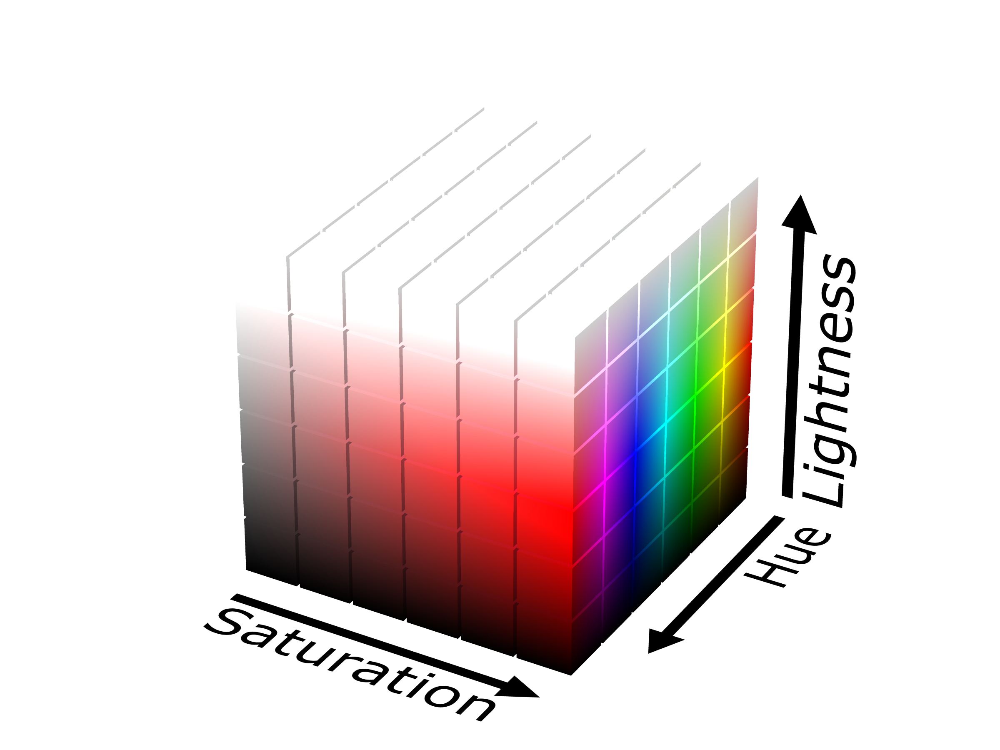

```{r include=FALSE}
library(knitr)
hook_output <- knit_hooks$get("output")
knit_hooks$set(output = function(x, options) {
   lines <- options$output.lines
   if (is.null(lines)) {
     return(hook_output(x, options))  # pass to default hook
   }
   x <- unlist(strsplit(x, "\n"))
   more <- "..."
   if (length(lines)==1) {        # first n lines
     if (length(x) > lines) {
       # truncate the output, but add ....
       x <- c(head(x, lines), more)
     }
   } else {
     x <- c(more, x[lines], more)
   }
   # paste these lines together
   x <- paste(c(x, ""), collapse = "\n")
   hook_output(x, options)
 })

opts_chunk$set(
  echo = TRUE,
  fig.width = 7, 
  fig.align = 'center',
  fig.asp = 0.618, # 1 / phi
  dpi = 320,
  out.width = "700px")
```

```{r, echo = FALSE, message=FALSE}
library(sass)
library(magrittr)
library(flair)
library(recipes)
library(tidyverse)
library(ggtext)
sass(sass_file("theme.sass"), output = "theme.css")
```

```{r, echo=FALSE}
orange <- "#EF8633"
blue <- "#006766"

sass(list(
  list(orange = orange,
       blue = blue),
  "
  .orange {color: $orange}
  .blue {color: $blue}
  "
))
```

```{r, echo=FALSE}
library(paletteer)
library(purrr)

palette_text <- function(text, pal) {
  colors <- paletteer_c(pal, nchar(text))

htmltools::div(
map2(strsplit(text, "")[[1]], 
     colors, 
     ~htmltools::span(.x, style = paste0("color:", .y, ";")))
)
}
```

# My history with color palettes

--


---

# My history with color palettes


---

# My history with color palettes


---

.pull-left[

]

.pull-right[

]

---

.center[
# Discoverability
]

--

.pull-left[
## Pros
- All palettes in one place
- Consistent API
]

--

.pull-right[
## Cons
- Hard to discover new palettes
- Hard to find similar palettes
- Hard to search for palettes
]

---

# {paletteer} v1.0.0


---

# {paletteer} v1.0.0

```{r}
plot(paletteer_d("wesanderson::GrandBudapest2"))
```

---

# {paletteer} v1.0.0

```{r}
plot(paletteer_c("viridis::magma", 10))
```

---

# {paletteer} v1.0.0

```{r}
plot(paletteer_c("ggthemes::Blue-Green Sequential", 256))
```

---

.center[
# palette2vec
]

--

# Proposed plan

--

- Develop a method that projects color into a multi-dimensional space

---

.center[
# palette2vec
]

# Proposed plan

- Develop a method that projects color into a multi-dimensional space
- Use embedded color-palette space to find clusters, similarities and neighbors

---

.center[
# palette2vec
]

# Proposed plan

- Develop a method that projects color into a multi-dimensional space
- Use embedded color-palette space to find clusters, similarities and neighbors
- Develop method to generate color palette from point in embedded space

---

## color palette similarity

.pull-left[

]
.pull-right[
<br>
### Similar colors used
### Not same saturation
]

---

## color palette similarity

.pull-left[

]
.pull-right[
<br>
### Same color
### Different lengths
]

---

## color palette similarity

.pull-left[

]
.pull-right[
<br>
### Same feel
### Muted colors
]

---

# Main problem

<br>

## color palettes contains a varied number of colors

<br>

## Each color can be represented in no less then 3 dimensions

---

# Main problem

## No trivial way to project 3 by N matrices into a vector of fixed length

---

### RGB color space

.center[

]

---

### HSL color space

.center[

]

---

### CIELAB color space

.center[

]

---

## We will be using hand-crafted custom features

- Number of colors
- Linearity
- Split linearity
- Contains at least one color
- Are all one color
- Summary statistics of inter-color distances
- Summary statistics of saturation
- Summary statistics of lightness

---

```{r, echo=FALSE}
feature_pals <- palette2vec::paletteer_palettes()[
  c("ggsci.nrc_npg",
    "ggsci.green_material",
    "rcartocolor.Temps",
    "RColorBrewer.BrBG")
  ] 

feature_gt <- function(pals, feature) {
  
  tibble(value = round(palette2vec::palette2vec(pals)[[feature]], 3),
         colors = map_chr(pals, palette2vec:::make_color_strip_svg)) %>%
    gt::gt() %>%
    gt::text_transform(locations = gt::cells_body("colors"),
                   fn = function(x) {
                     map_chr(pals, palette2vec:::make_color_strip_svg)
                   })
}
```

# Linearity

```{r, echo=FALSE}
feature_gt(feature_pals, "linear")
```

---

# Linearity split

```{r, echo=FALSE}
feature_gt(feature_pals, "linear_split")
```

---

## At least one colors is green (lower is better)

```{r, echo=FALSE}
feature_gt(feature_pals, "contains_min_green")
```

---

# All colors are green (lower is better)

```{r, echo=FALSE}
feature_gt(feature_pals, "contains_all_green")
```

---

# All colors are red (lower is better)

```{r, echo=FALSE}
feature_gt(feature_pals, "contains_all_red")
```

---

### palette2vec

```{r}
library(palette2vec)
base_palettes <- list(terrain = terrain.colors(10),
                      heat = heat.colors(16),
                      topo = topo.colors(8))
palette2vec(base_palettes)
```

---

```{r}
palette2vec(paletteer_palettes())
```

---

### Using these features can we apply UMAP to see if we were able to capture the right things

`umap_embedding()` will take a list of palettes and

- calculate palette2vec
- normalize features
- project to 2d using UMAP
- opens shiny app for exploration

```{r, eval=FALSE}
umap_embedding(paletteer_palettes())
```

---


---


---


---


---


---


---


---

class: center, middle

# Thank you!

### `r icon::fa("github")` [EmilHvitfeldt](https://github.com/EmilHvitfeldt/)
### `r icon::fa("twitter")` [@Emil_Hvitfeldt](https://twitter.com/Emil_Hvitfeldt)
### `r icon::fa("linkedin")` [emilhvitfeldt](linkedin.com/in/emilhvitfeldt/)
### `r icon::fa("laptop")` [www.hvitfeldt.me](www.hvitfeldt.me)

Slides created via the R package [xaringan](https://github.com/yihui/xaringan).

